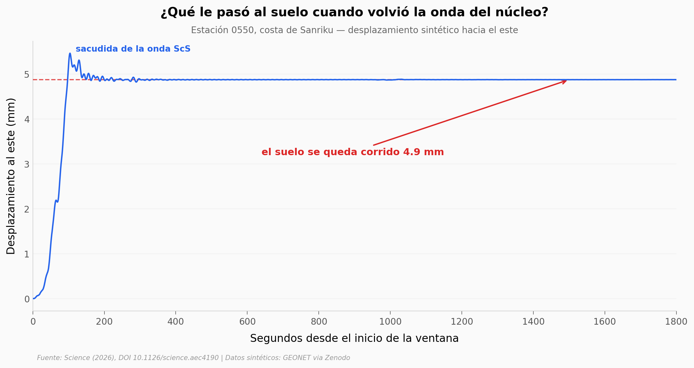

# Una onda sísmica fue al núcleo de la Tierra, volvió y movió Japón entero

El terremoto de Tohoku-Oki de 2011 (magnitud 9,0) lanzó una onda de corte tan fuerte que bajó hasta el núcleo de la Tierra, rebotó y regresó a la superficie. Al reaparecer en Japón —ya como onda **ScS**—, los GPS de todo el país registraron un escalón permanente hacia el este. Lo más raro: el suelo se corrió **casi al mismo tiempo** en más de 2.000 km de archipiélago.

**El hallazgo:** un **escalón hacia el este de hasta 5 a 6 mm** observado en GNSS por todo Japón, atribuido a deslizamiento en las fallas megathrust disparado por la onda ScS que volvió del núcleo.

## Gráfica clave



## Reproducir

[](https://colab.research.google.com/github/Ciencia-a-Mordiscos/lab/blob/main/papers/2026-06-18-scs-tohoku-megathrust-slip/notebook.ipynb)

O localmente:
```bash
pip install pandas matplotlib numpy scipy
jupyter execute notebook.ipynb
```

## Datos

- `datos/step_por_estacion.csv` — escalón, pico-a-pico, rise time y distancia al epicentro de 1.221 estaciones GNSS.
- `datos/timeseries_0550.csv` — serie sintética completa (1.800 s, 1 Hz) de la estación más golpeada (0550, costa de Sanriku).
- `datos/step_por_distancia.csv` — escalón promedio y máximo agregado por banda de distancia.

> Las series son **sintéticas** (salida del modelo de los autores), no observaciones GNSS crudas: reproducen el escalón pero subestiman un poco su tamaño (~4,8 vs 5-6 mm observado).

## Links

- **Video:** [Pendiente]
- **Paper:** [Science — DOI: 10.1126/science.aec4190](https://doi.org/10.1126/science.aec4190)
- **Datos originales:** [Zenodo (series sintéticas GEONET)](https://doi.org/10.5281/zenodo.19597316) · [PANGAEA (1-Hz PPP observado)](https://doi.org/10.1594/PANGAEA.914110)
