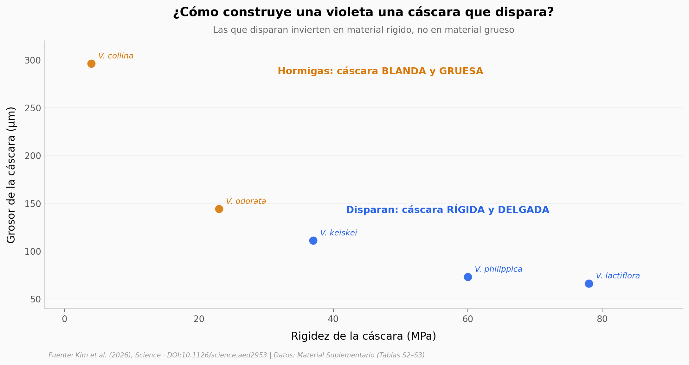

# Una violeta dispara sus semillas de a una, con la misma fuerza cada vez

Las violetas (*Viola* spp.) lanzan sus semillas como una catapulta lenta: una tras otra, con fuerza pareja, desde una sola vaina. Kim et al. (2026, *Science*) midieron las propiedades mecánicas de la cáscara en 5 especies y descubrieron que las que disparan están construidas distinto a las que dejan que las hormigas se lleven la semilla — y que el truco está en la **forma**, no en el material.

**El hallazgo:** las violetas que disparan tienen la cáscara **~4 veces más rígida (58 vs 14 MPa) pero un 62 % más delgada** que las dispersadas por hormigas. Logran fuerza suficiente con menos material — y el mismo principio funciona en valvas artificiales a lo largo de **4,4 órdenes de magnitud** de rigidez.

## Gráfica clave



## Reproducir

[](https://colab.research.google.com/github/Ciencia-a-Mordiscos/lab/blob/main/papers/2026-06-18-viola-vaina-pinzamiento-secuencial/notebook.ipynb)

O localmente:
```bash
pip install pandas matplotlib numpy
jupyter execute notebook.ipynb
```

## Datos

- `datos/propiedades_valvas.csv` — 5 especies de *Viola* × 5 propiedades mecánicas (con SD). Tabla S2 del Material Suplementario.
- `datos/valvas_artificiales.csv` — 12 valvas artificiales bioinspiradas: 3 materiales × rango de grosores, tejido responsivo fijo. Tabla S3.

## Links

- **Video:** [Pendiente]
- **Paper:** [Science — DOI: 10.1126/science.aed2953](https://doi.org/10.1126/science.aed2953)
- **Datos originales:** Material Suplementario del paper (Tablas S2–S3). Repositorio canónico: [Dryad](https://doi.org/10.5061/dryad.pc866t246) (bajo curación al consultar).
