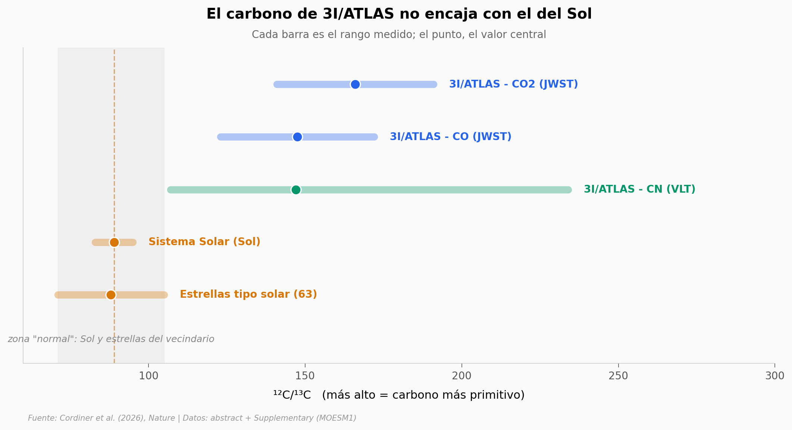

# El carbono de 3I/ATLAS es casi el doble de primitivo que el del Sol

3I/ATLAS es apenas el tercer objeto interestelar que hemos atrapado cruzando el sistema solar. Con el telescopio JWST, un equipo midió la huella isotópica de su gas y encontró una química que no se parece a nada del sistema solar: su carbono está mucho menos "cocinado" y su agua rebosa de deuterio. Ambas cosas apuntan a que nació frío y muy antiguo.

**El hallazgo:** El ¹²C/¹³C de 3I/ATLAS ronda **147–166**, casi el doble del solar (**89**) — y ningún lugar de la Vía Láctea actual llega tan alto: el gradiente galáctico se queda en ~97.

## Gráfica clave



## Reproducir

[](https://colab.research.google.com/github/Ciencia-a-Mordiscos/lab/blob/main/papers/2026-06-22-3i-atlas-isotopos-origen-frio/notebook.ipynb)

O localmente:
```bash
pip install pandas matplotlib numpy
jupyter execute notebook.ipynb
```

## Datos

- `datos/isotopos_12c13c_comparacion.csv` — ¹²C/¹³C de 3I/ATLAS (CO₂, CO, CN) frente al Sol y 63 estrellas tipo solar (5 filas).
- `datos/gradiente_galactico_12c13c.csv` — gradiente radial galáctico ¹²C/¹³C = 4.77·R_GC + 20.76 con banda 1σ, de 0 a 16 kpc (33 filas).
- `datos/evidencia_origen.csv` — 8 líneas de evidencia (origen frío / época distante) con su fuerza (8 filas).
- `datos/dh_astration_tiempo.csv` — D/H elemental: Big Bang → medio interestelar local por astración (2 filas).

> Cifras destiladas del abstract + Supplementary (MOESM1) revisado por pares; el gradiente galáctico se computó de la ecuación publicada por Yan et al. (2023).

## Links

- **Video:** [Pendiente]
- **Paper:** [Nature — DOI: 10.1038/s41586-026-10771-6](https://doi.org/10.1038/s41586-026-10771-6)
- **Datos originales:** [Supplementary Information (MOESM1)](https://static-content.springer.com/esm/art%3A10.1038%2Fs41586-026-10771-6/MediaObjects/41586_2026_10771_MOESM1_ESM.pdf)
