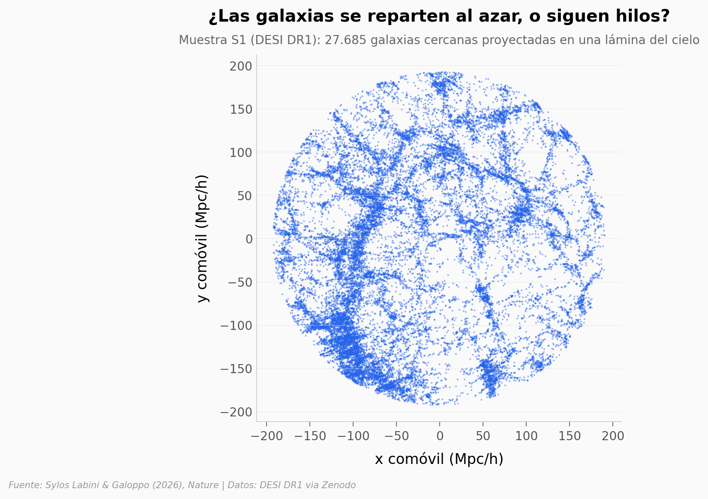

# La anisotropía cósmica a escala de un gigaparsec

El principio cosmológico asume que, a escalas suficientemente grandes, el universo se ve igual en todas las direcciones. Un mapa de **150.136 galaxias** de DESI DR1 encuentra hilos y direcciones que persisten hasta escalas del orden de **un gigaparsec** (mil millones de pársecs), poniendo a prueba ese supuesto.

**El hallazgo:** la distribución de galaxias muestra **estructuras anisotrópicas persistentes hasta ~1 Gpc**, con una significancia conservadora **>3σ** según el estadístico ADPD del paper frente a catálogos simulados ΛCDM.

## Gráfica clave



## Reproducir

[](https://colab.research.google.com/github/Ciencia-a-Mordiscos/lab/blob/main/papers/2026-06-24-anisotropia-cosmica-gigaparsec/notebook.ipynb)

O localmente:
```bash
pip install pandas matplotlib numpy
jupyter execute notebook.ipynb
```

## Datos

- `datos/galaxias_S1.csv` — 27.685 galaxias cercanas (BGS), r_max ~194 Mpc/h
- `datos/galaxias_S2.csv` — 36.290 galaxias (BGS), r_max ~293 Mpc/h
- `datos/galaxias_S3.csv` — 48.291 galaxias (BGS), r_max ~435 Mpc/h
- `datos/galaxias_S4.csv` — 29.109 galaxias (BGS), r_max ~628 Mpc/h
- `datos/galaxias_LRGS.csv` — 8.761 galaxias (LRGS), r_max ~1004 Mpc/h ≈ 1 Gpc/h

Columnas: `x_mpch, y_mpch, z_mpch` (coordenadas comóviles en Mpc/h).

> **Nota:** el notebook calcula un **proxy didáctico** de anisotropía direccional para *ilustrar* el concepto. NO es el ADPD del paper, y su razón (×) nunca debe leerse como una significancia σ. La >3σ es del paper.

## Links

- **Video:** [Ver en YouTube](https://youtube.com/shorts/HdNMtY8i86g)
- **Paper:** [Nature — DOI: 10.1038/s41586-026-10702-5](https://doi.org/10.1038/s41586-026-10702-5)
- **Datos originales:** [Zenodo](https://zenodo.org/records/20118015) · [DESI DR1](https://data.desi.lbl.gov/doc/releases/dr1/)
