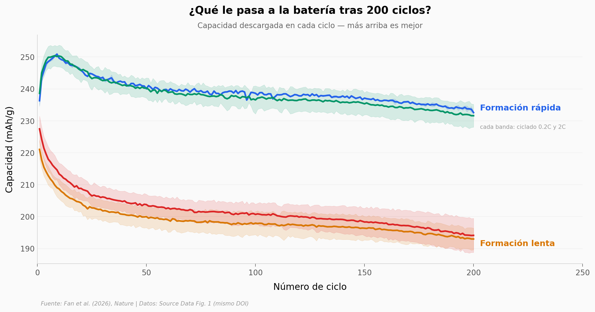

# Cargar rápido una batería nueva la hace durar más

Toda la industria forma sus baterías cargándolas **despacio** la primera vez. Este paper de *Nature* probó lo contrario en cátodos ricos en litio: cargar **rápido** esa primera vez (subir la corriente de 0.2C a 2C) deja atrás litio residual que refuerza la estructura y produce una batería con más capacidad y mucha mejor retención.

**El hallazgo:** la formación rápida da **+20% de capacidad** y retiene **98% tras 200 ciclos**, frente al **87%** de la formación lenta. Y la ventaja no está al inicio: **crece** de +7% (ciclo 1) a +21% con el uso.

## Gráfica clave



## Reproducir

[](https://colab.research.google.com/github/Ciencia-a-Mordiscos/lab/blob/main/papers/2026-06-24-formacion-rapida-catodos-litio/notebook.ipynb)

O localmente:
```bash
pip install pandas matplotlib numpy
jupyter execute notebook.ipynb
```

## Datos

- `datos/fig1e_ciclado.csv` — capacidad (mAh/g) vs ciclo (1–200) con desviación estándar, 4 condiciones LLO.
- `datos/fig1d_irrev_ce.csv` — capacidad irreversible y eficiencia coulómbica del 1er ciclo, 4 condiciones.
- `datos/fig1b_carga_inicial.csv` — perfil de voltaje de la carga de formación (potencial vs litio en el cátodo), rápida vs lenta.

## Links

- **Video:** [Ver en YouTube](https://youtube.com/shorts/dDFC5h-MuwA)
- **Paper:** [Nature — DOI: 10.1038/s41586-025-09553-3](https://doi.org/10.1038/s41586-025-09553-3)
- **Datos originales:** [Source Data Fig. 1 (MOESM2, mismo DOI)](https://static-content.springer.com/esm/art%3A10.1038%2Fs41586-025-09553-3/MediaObjects/41586_2025_9553_MOESM2_ESM.xlsx)
