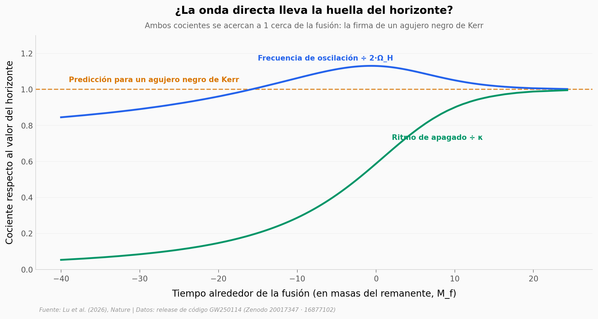

# GW250114: la huella del horizonte de un agujero negro

Un agujero negro arrastra el espacio a su alrededor, y ese arrastre tiene una frecuencia. En GW250114 —una de las fusiones de agujeros negros más ruidosas jamás detectadas— la señal trajo escondida una "onda directa" que oscila justo al doble de esa frecuencia y se apaga al ritmo de la gravedad del horizonte. La reconstruimos desde los datos públicos del evento.

**El hallazgo:** la onda directa aparece con **SNR de filtro adaptado ≈ 15,8 (Hanford) / 17,1 (Livingston)**, y sus frecuencias convergen en los valores del horizonte de un agujero negro de Kerr.

## Gráfica clave



## Reproducir

[](https://colab.research.google.com/github/Ciencia-a-Mordiscos/lab/blob/main/papers/2026-06-24-gw250114-horizonte-agujero-negro/notebook.ipynb)

O localmente:
```bash
pip install pandas matplotlib numpy
jupyter execute notebook.ipynb
```

## Datos

- `datos/strain_blanqueado.csv` — forma de onda blanqueada de H1: observada, modelo NRSur7dq4 y con la onda directa sustraída (3.277 puntos).
- `datos/snr_onda_directa.csv` — posterior de la SNR de la onda directa en H1/L1, óptima y de filtro adaptado (10.000 muestras).
- `datos/frecuencia_onda_directa.csv` — evolución de la frecuencia compleja de la onda directa, normalizada a los valores del horizonte (1.500 puntos).
- `datos/remanente_posterior.csv` — posterior NRSur7dq4 del remanente y los progenitores: masa final, espín final, masas de origen (8.000 muestras).

## Links

- **Video:** [Pendiente]
- **Paper:** [Nature — DOI: 10.1038/s41586-026-10696-0](https://doi.org/10.1038/s41586-026-10696-0)
- **Datos originales:** [Zenodo 20017347](https://zenodo.org/records/20017347) · [Zenodo 16877102](https://zenodo.org/records/16877102)
