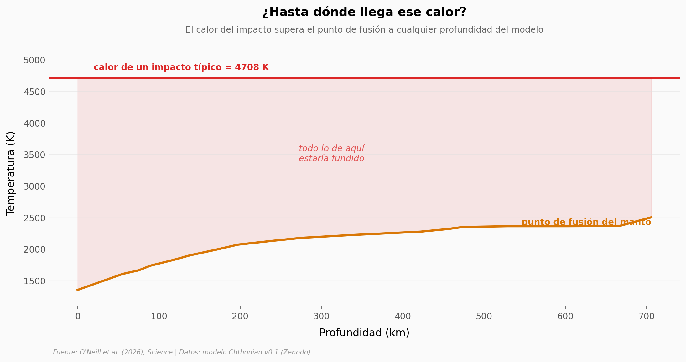

# El calor oculto del Hadeano

Los modelos clásicos de la Tierra primitiva calculaban si la corteza estaba fundida mirando solo el calor interno. Un modelo geodinámico nuevo (*Chthonian*) suma lo que faltaba: el calor de los impactos. En sus salidas, un solo impacto típico bastaría para fundir el manto a cualquier profundidad.

**El hallazgo:** En el modelo, un impactor de 100 km a 26 km/s elevaría la temperatura del choque hasta **~4.700 K — casi el doble (1,9×) del punto de fusión máximo del manto (~2.500 K)**, fundiendo la columna entera.

## Gráfica clave



## Reproducir

[](https://colab.research.google.com/github/Ciencia-a-Mordiscos/lab/blob/main/papers/2026-06-25-calor-impactos-hadean-oculto/notebook.ipynb)

O localmente:
```bash
pip install pandas matplotlib numpy
jupyter execute notebook.ipynb
```

## Datos

- `datos/impactos_hadeano.csv` — catálogo de 109 impactos del modelo (banda ecuatorial): tiempo de modelo (Ma) y radio (km).
- `datos/solidus_manto.csv` — curva solidus de Stixrude: 19 puntos de profundidad (km) vs. temperatura de fusión (K).
- `datos/calentamiento_vs_velocidad.csv` — presión pico de choque (GPa) y salto de temperatura (K) según velocidad, para un impactor de 100 km.
- `datos/calor_vs_tamano.csv` — energía térmica relativa vs. radio del impactor (escalado ~R³).

## Links

- **Video:** [Ver en YouTube](https://youtube.com/shorts/vmiHu1Usv-A)
- **Paper:** [Science — DOI: 10.1126/science.aeb5402](https://doi.org/10.1126/science.aeb5402)
- **Datos originales:** [modelo Chthonian v0.1 — Zenodo](https://doi.org/10.5281/zenodo.18919910)

> Estas son las **salidas del modelo** (catálogo de impactos, curva solidus, fórmula de calentamiento), no una corrida del solver geodinámico completo. Las edades están en "tiempo de modelo".
