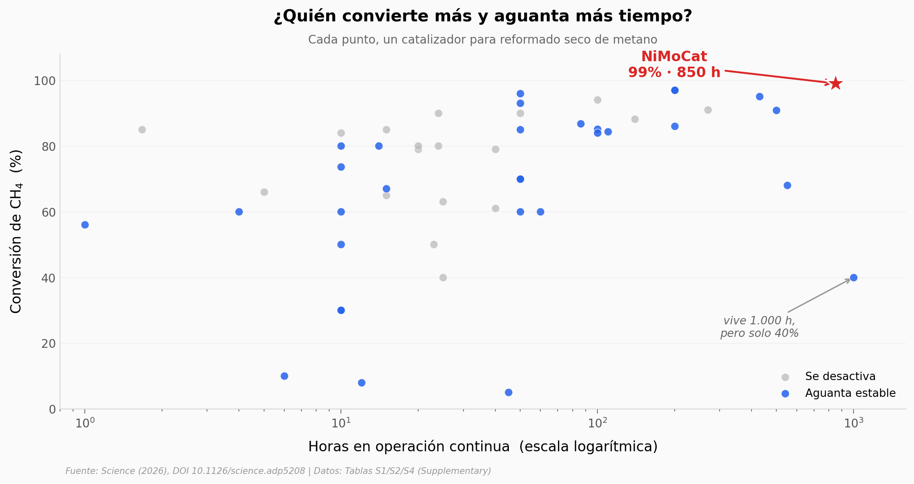

# Un catalizador que convierte basura en combustible — y aguanta 850 horas

De 50 catalizadores publicados para reformar metano con CO₂ (la reacción que convierte residuos y gas en materia prima de combustibles), uno destaca solo: NiMoCat, un nanocatalizador de níquel-molibdeno sobre MgO. Es el único que cruza el 99 % de conversión de CH₄ y encima lleva 850 horas sin apagarse. Pero el notebook también muestra la letra pequeña: ese 99 % era en polvo de laboratorio; al prensarlo en pellets de reactor, la conversión cae ~22 puntos.

**El hallazgo:** **NiMoCat es 1 de 50 en superar el 99 % de conversión de CH₄, con 850 h de vida útil — pero pierde ~22 puntos al pasar de polvo a pellet industrial.**

## Gráfica clave



## Reproducir

[](https://colab.research.google.com/github/Ciencia-a-Mordiscos/lab/blob/main/papers/2026-06-25-nimocat-reformado-residuos/notebook.ipynb)

O localmente:
```bash
pip install pandas matplotlib numpy
jupyter execute notebook.ipynb
```

## Datos

- `datos/catalizadores_drm.csv` — 50 catalizadores comparados (Tabla S1): temperatura, horas en operación, conversión de CH₄ y CO₂, rendimiento, relación H₂/CO, si se desactiva.
- `datos/conversion_pellets.csv` — conversión en polvo vs pellets de 3/4/5 mm (Tabla S4), 4 filas.
- `datos/tof_temperatura.csv` — actividad por sitio (TOF) de 550 a 750 °C (Tabla S2), 5 filas.

## Links

- **Video:** [Ver en YouTube](https://youtube.com/shorts/JeZ3VVodBy8)
- **Paper:** [Science — DOI: 10.1126/science.adp5208](https://doi.org/10.1126/science.adp5208)
- **Datos originales:** [Supplementary Materials (Tablas S1, S2, S4)](https://www.science.org/doi/suppl/10.1126/science.adp5208/suppl_file/science.adp5208_sm.pdf)
