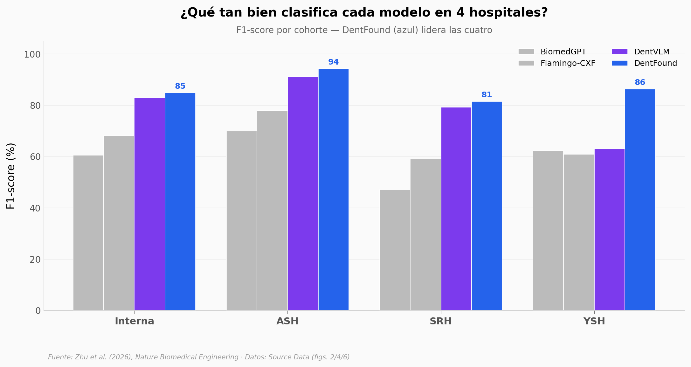

# ¿Una IA lee tu radiografía dental mejor que el dentista?

DentFound es un modelo de visión y lenguaje entrenado con más de **101.000 pacientes** que lee panorámicas dentales y escribe el reporte completo. Abrimos los datos del paper para ver dos cosas: qué tan bien clasifica hallazgos frente a otros modelos, y qué pasa cuando lo comparan con un radiólogo humano.

**El hallazgo:** DentFound escribe reportes **más completos** que un humano (Recall 0,811 vs 0,518, +56,6%), porque el humano se enfoca en la queja principal y omite hallazgos incidentales. Pero en el juicio subjetivo de expertos, el humano todavía queda ligeramente arriba en 10 de 12 comparaciones. "Más completo" no es lo mismo que "mejor".

## Gráfica clave



## Reproducir

[](https://colab.research.google.com/github/Ciencia-a-Mordiscos/lab/blob/main/papers/2026-06-26-dentfound-panoramica-dental/notebook.ipynb)

O localmente:
```bash
pip install pandas matplotlib numpy
jupyter execute notebook.ipynb
```

## Datos

- `datos/benchmark_cohorts.csv` — F1/Recall/Accuracy de 4 modelos en 4 cohortes hospitalarias (16 filas).
- `datos/ai_vs_human_report.csv` — completitud de reportes: DentFound vs radiólogo humano (Precision/Recall/F1).
- `datos/expert_ratings.csv` — ratings subjetivos (1-5) de 4 grupos de expertos en 3 dimensiones.
- `datos/ablation_mask.csv` — ablación de la máscara instance-guidance (CIDEr/BLEU-4/ROUGE-L).

> Las imágenes clínicas no son públicas (privacidad de pacientes). Estos CSV vienen del Source Data de las figuras del paper (revisado por pares).

## Links

- **Video:** [Pendiente]
- **Paper:** [Nature Biomedical Engineering — DOI: 10.1038/s41551-026-01713-8](https://doi.org/10.1038/s41551-026-01713-8)
- **Datos originales:** [Source Data del paper](https://doi.org/10.1038/s41551-026-01713-8)
- **Código del modelo:** [github.com/ahukui/DentFound](https://github.com/ahukui/DentFound)
