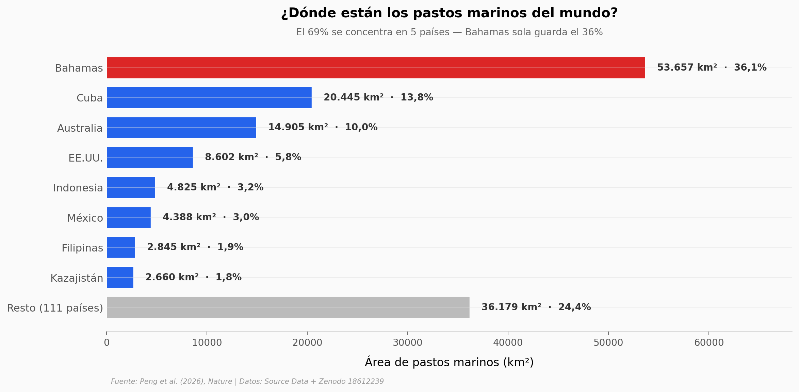

# Casi todos los pastos marinos del mundo caben en 5 países

El primer mapa global de pastos marinos a 10 metros de resolución —construido con 4,75 millones de imágenes de satélite y un clasificador de aprendizaje profundo— reveló 148.506 km² de praderas submarinas en todo el planeta. Y casi todo está concentrado en muy pocos lugares.

**El hallazgo:** **El 69% de los pastos marinos del mundo está en 5 países, y Bahamas sola guarda el 36%.** Bajando al nivel de celda, 31 de las 1.987 cuadrículas de 1° (apenas el 1,6%) concentran la mitad del área mundial.

## Gráfica clave



## Reproducir

[](https://colab.research.google.com/github/Ciencia-a-Mordiscos/lab/blob/main/papers/2026-06-30-pastos-marinos-mapa-global/notebook.ipynb)

O localmente:
```bash
pip install pandas matplotlib numpy scipy
jupyter execute notebook.ipynb
```

## Datos

- `datos/seagrass_por_pais.csv` — área de pastos marinos, pérdida bruta y carbono orgánico por país (119 filas, 2019).
- `datos/seagrass_grid_2019.csv` — área de pastos marinos por celda de 1° de latitud/longitud (1.987 filas, 2019).

> Ambos provienen de los Source Data del paper (MOESM4 y MOESM5), que agregan el dataset completo publicado en Zenodo.

## Links

- **Video:** [Ver en YouTube](https://youtube.com/shorts/hP3R4INmoOI)
- **Paper:** [Nature — DOI: 10.1038/s41586-026-10704-3](https://doi.org/10.1038/s41586-026-10704-3)
- **Datos originales:** [Zenodo 18612239](https://doi.org/10.5281/zenodo.18612239)
