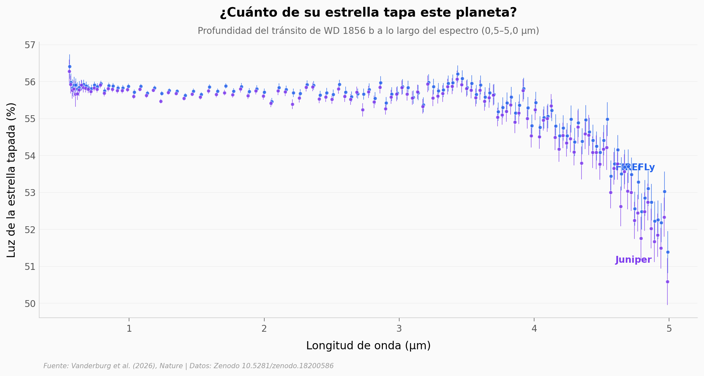

# La atmósfera de un planeta que orbita una enana blanca

El James Webb apuntó su espectrógrafo a WD 1856 b, un planeta gigante que gira alrededor del cadáver estelar de una estrella como el Sol, y por primera vez leyó su atmósfera. Lo que encontró: aerosoles, hidrocarburos y una temperatura muy por encima de lo que la física predecía.

**El hallazgo:** el tránsito **tapa 51–56% de la luz** de la estrella (el más profundo conocido), el planeta pesa **4,3–10,9 masas de Júpiter**, y su temperatura efectiva (**~390–412 K**) supera en unos **242 K** los 160 K de equilibrio esperados.

## Gráfica clave



## Reproducir

[](https://colab.research.google.com/github/Ciencia-a-Mordiscos/lab/blob/main/papers/2026-07-01-atmosfera-enana-blanca-wd1856/notebook.ipynb)

O localmente:
```bash
pip install pandas matplotlib numpy
jupyter execute notebook.ipynb
```

## Datos

- `datos/espectro_transmision.csv` — espectro de transmisión, 254 puntos (127 por pipeline: FIREFLy y Juniper), 0,5–5,0 μm
- `datos/posterior_mp.csv` — posterior de la masa del planeta (M_Júpiter), ambos pipelines
- `datos/posterior_teff.csv` — posterior de la temperatura efectiva (K), ambos pipelines

## Links

- **Video:** [Ver en YouTube](https://youtube.com/shorts/X1SItsxdkwg)
- **Paper:** [Nature — DOI: 10.1038/s41586-026-10514-7](https://doi.org/10.1038/s41586-026-10514-7)
- **Datos originales:** [Zenodo](https://doi.org/10.5281/zenodo.18200586)
