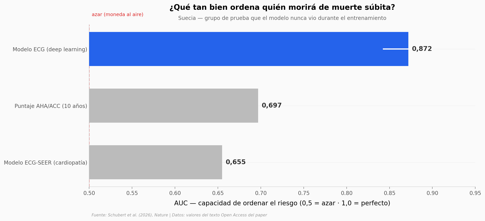

# Un biomarcador en el ECG para la muerte súbita, hallado con deep learning

La muerte súbita cardíaca es, en teoría, evitable con un desfibrilador. El problema es saber a quién ponérselo: el examen estándar de hoy (la FEVI) se le escapa a la mayoría. Un equipo le puso deep learning a 441.614 electrocardiogramas de una región de Suecia, cruzados con certificados de defunción, y encontró en la onda del ECG una señal —nunca antes descrita— que ordena el riesgo mucho mejor que el estándar.

**El hallazgo:** **el modelo ordena el riesgo de muerte súbita con un AUC de 0,87 frente al 0,70 del estándar clínico, y marca un grupo de alto riesgo del que el 86,1% es invisible para la FEVI.**

## Gráfica clave



## Reproducir

[](https://colab.research.google.com/github/Ciencia-a-Mordiscos/lab/blob/main/papers/2026-07-01-biomarcador-ecg-muerte-subita/notebook.ipynb)

O localmente:
```bash
pip install pandas matplotlib numpy
jupyter execute notebook.ipynb
```

## Datos

- `datos/discriminacion_mcs.csv` — AUC de discriminación de muerte súbita (modelo ECG vs AHA/ACC vs SEER)
- `datos/generalizacion_cohortes.csv` — AUC zero-shot en EE.UU., Taiwán y Suecia + control no-arrítmico
- `datos/estratificacion_riesgo.csv` — grupo de alto riesgo del ECG vs FEVI reducida (tamaño y tasa anual)

## Links

- **Video:** [Ver en YouTube](https://youtube.com/shorts/p9hJJWC36R0)
- **Paper:** [Nature — DOI: 10.1038/s41586-026-10674-6](https://doi.org/10.1038/s41586-026-10674-6)
- **Código y modelo:** [alexmschubert/ECG-SCD](https://github.com/alexmschubert/ECG-SCD)
