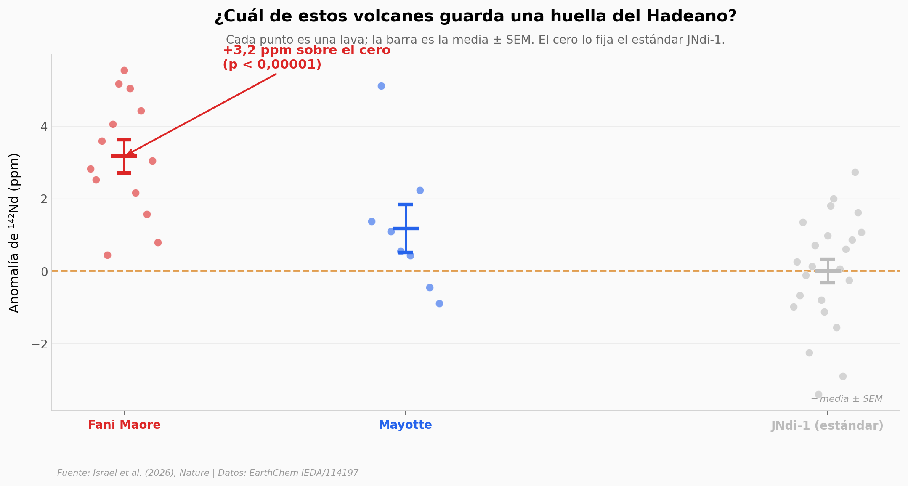

# Una huella de hace 4.500 millones de años en una lava de hoy

El volcán submarino Fani Maore, en el archipiélago de las Comoras, escupió lavas con una anomalía isotópica de neodimio-142 que solo pudo fabricarse en los primeros 100 millones de años de la Tierra. Este notebook reproduce las mediciones y el mecanismo propuesto: bridgmanita cristalizada de un océano de magma hadeano.

**El hallazgo:** las lavas de Fani Maore muestran **+3,2 ppm de anomalía de ¹⁴²Nd** (n=13), estadísticamente distintas del estándar (Welch p < 0,00001) y de su volcán vecino Mayotte (p = 0,028; Cohen's d = 1,15).

## Gráfica clave



## Reproducir

[](https://colab.research.google.com/github/Ciencia-a-Mordiscos/lab/blob/main/papers/2026-07-01-bridgmanita-hadeana-manto/notebook.ipynb)

O localmente:
```bash
pip install pandas matplotlib numpy scipy
jupyter execute notebook.ipynb
```

## Datos

- `datos/mu142nd_todos.csv` — 44 análisis (13 Fani Maore + 8 Mayotte + 23 estándar JNdi-1) con μ¹⁴²Nd y error 2se por muestra
- `datos/particion_brg_melt.csv` — coeficientes de partición D(Brg/fundido) para Nd y Sm (DAC a 53 y 97 GPa)
- `datos/bridgmanita_composicion.csv` — fracciones molares bulk vs bridgmanita a 53 y 97 GPa

## Links

- **Video:** [Pendiente]
- **Paper:** [Nature — DOI: 10.1038/s41586-026-10719-w](https://doi.org/10.1038/s41586-026-10719-w)
- **Datos originales:** [EarthChem (IEDA)](https://doi.org/10.60520/IEDA/114197)
