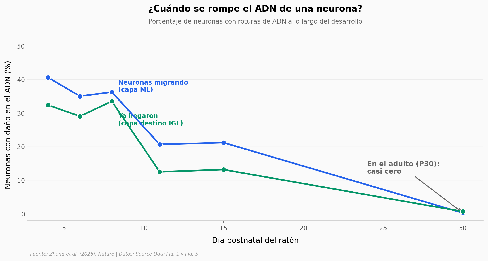

# Para llegar a su sitio en el cerebro, una neurona se rompe el ADN

Para migrar a su capa final en el cerebelo, las neuronas recién nacidas se apretujan por pasadizos más estrechos que su propio núcleo. Ese apretón les parte las dos cadenas del ADN —y resulta ser parte **normal** del desarrollo, no una enfermedad—.

**El hallazgo:** durante la migración, **el 41% de las neuronas** tienen el ADN roto; en el cerebro adulto el daño baja a **0,2%**. La célula repara cada corte sobre la marcha en una o dos horas, sin morir.

## Gráfica clave



## Reproducir

[](https://colab.research.google.com/github/Ciencia-a-Mordiscos/lab/blob/main/papers/2026-07-02-neuronas-migracion-dano-adn/notebook.ipynb)

O localmente:
```bash
pip install pandas matplotlib numpy scipy
jupyter execute notebook.ipynb
```

## Datos

- `datos/gamma_h2ax_desarrollo.csv` — % de neuronas con daño (γ-H2AX) por estadio (P4–P30) y capa. 110 mediciones.
- `datos/corredor_dano.csv` — % de neuronas con daño según el ancho del corredor (2–5 µm). 29 mediciones.
- `datos/reparacion_53bp1_min.csv` — vida media de los focos de reparación 53BP1 (min). 66 focos.
- `datos/andar_lig4.csv` — ancho de la base trasera al caminar, Control vs Lig4-KO. 143 huellas.

## Links

- **Video:** [Ver en YouTube](https://youtube.com/shorts/Xm7KcWfZ_dE)
- **Paper:** [Nature — DOI: 10.1038/s41586-026-10648-8](https://doi.org/10.1038/s41586-026-10648-8)
- **Datos originales:** [Source Data Fig. 1 y Fig. 5 (Nature, acceso abierto)](https://doi.org/10.1038/s41586-026-10648-8)
