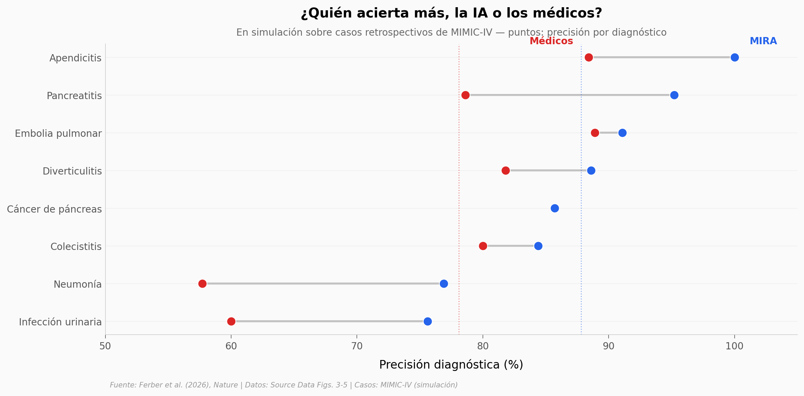

# ¿Puede una IA manejar un caso clínico mejor que un médico?

MIRA es un agente de IA que no solo conversa: opera dentro de una historia clínica electrónica simulada, pide análisis, lee imágenes, arma diagnósticos y propone tratamientos. En una simulación sobre casos reales pero retrospectivos de MIMIC-IV, superó a médicos certificados en precisión diagnóstica —bajo las mismas restricciones—, aunque no ganó en todo.

**El hallazgo:** **MIRA acertó 87,8 % de los diagnósticos frente al 78,1 % de los médicos (+9,7 pp)**, igualando o superándolos en los 8 diagnósticos evaluados. Pero en radiología los médicos siguen adelante (61,5 % vs 55,3 %).

## Gráfica clave



## Reproducir

[](https://colab.research.google.com/github/Ciencia-a-Mordiscos/lab/blob/main/papers/2026-07-03-mira-ia-medica-autonoma/notebook.ipynb)

O localmente:
```bash
pip install pandas matplotlib numpy
jupyter execute notebook.ipynb
```

## Datos

- `datos/diagnostico_mira_vs_medicos.csv` — precisión diagnóstica MIRA vs médicos board-certified, 8 diagnósticos + global
- `datos/precision_por_tarea.csv` — precisión por tarea clínica (examen, sangre, microbiología, radiología)
- `datos/seguridad_medicacion.csv` — chequeos de seguridad de medicación sobre 56 escenarios cada uno
- `datos/decision_ingreso.csv` — matriz de decisiones de ingreso (embolia pulmonar y neumonía)
- `datos/transcripcion_recetas.csv` — fidelidad de transcripción por campo sobre 468 prescripciones

## Links

- **Video:** [Ver en YouTube](https://youtube.com/shorts/Qo2Pl8C7rIc)
- **Paper:** [Nature — DOI: 10.1038/s41586-026-10675-5](https://doi.org/10.1038/s41586-026-10675-5)
- **Datos originales:** Source Data (Figs. 3–5) del artículo · [MIMIC-IV v2.2 (PhysioNet)](https://physionet.org/content/mimiciv/2.2/)
- **Código de MIRA:** [Dyke-F/MIRA](https://github.com/Dyke-F/MIRA)
