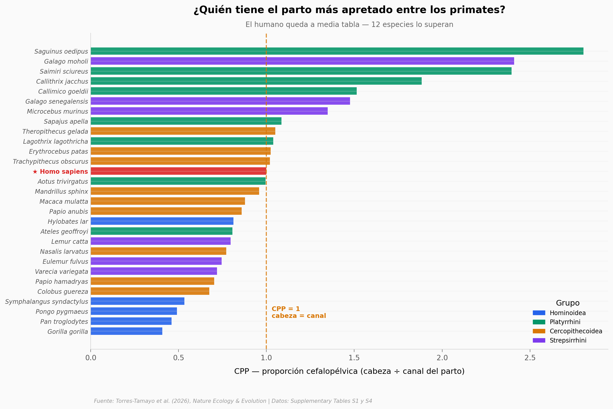

# El parto humano no es el más difícil de los primates

Durante décadas el libro de texto repitió que el parto humano era el más apretado del reino primate, el precio de caminar erguidos con una cabeza enorme. Un equipo midió en 3D la pelvis y el cráneo neonatal de 29 especies de primates y reordenó la lista: el humano queda a media tabla.

**El hallazgo:** El humano ocupa el **puesto 13 de 29** en estrechez cefalopélvica — **12 especies** tienen un parto más apretado. Eso sí, entre los simios el humano es la excepción: es el ape con el encaje más justo (CPP 1,00 frente a 0,41 del gorila).

## Gráfica clave



## Reproducir

[](https://colab.research.google.com/github/Ciencia-a-Mordiscos/lab/blob/main/papers/2026-07-06-parto-cefalopelvico-primates/notebook.ipynb)

O localmente:
```bash
pip install pandas matplotlib numpy scipy
jupyter execute notebook.ipynb
```

## Datos

- `datos/cpp_primates.csv` — Tabla S1 completa: CPP (sinciput y cara), áreas de entrada pélvica, áreas de cabeza y medidas lineales. 29 especies.
- `datos/cpp_bodymass.csv` — Merge de Tabla S1 (CPP sinciput) + Tabla S4 (masa corporal femenina). 29 especies.

## Links

- **Video:** [Ver en YouTube](https://youtube.com/shorts/ebIm9hRm6sA)
- **Paper:** [Nature Ecology & Evolution — DOI: 10.1038/s41559-026-03102-5](https://doi.org/10.1038/s41559-026-03102-5)
- **Datos originales:** [Supplementary Information (MOESM2)](https://static-content.springer.com/esm/art%3A10.1038%2Fs41559-026-03102-5/MediaObjects/41559_2026_3102_MOESM2_ESM.xlsx)
- **Código de réplica:** [OSF](https://osf.io/2yk8s/)
