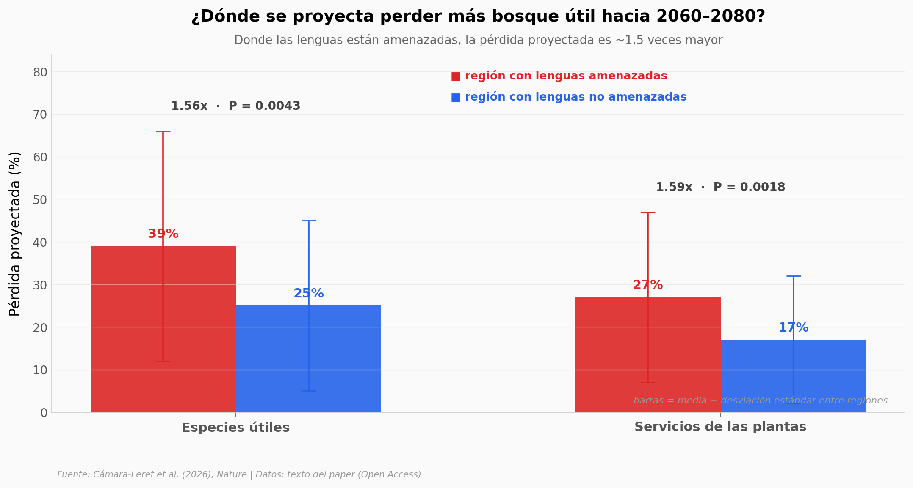

# El bosque que también es una biblioteca

En la Amazonía, **5.796 plantas nativas** tienen un uso conocido para la gente —medicina, comida, construcción, veneno—: un tercio de toda la flora con semilla del bioma. Ese conocimiento vive en idiomas, y de las 156 lenguas indígenas vivas de la cuenca, el 55% están amenazadas. Este notebook cruza dónde se apaga el idioma con dónde el clima golpeará más fuerte hacia 2060–2080.

**El hallazgo:** En las regiones con lenguas indígenas amenazadas se proyecta perder **~1,5 veces más** bosque útil (39% vs 25% de las especies; 27% vs 17% de los servicios) hacia 2060–2080.

## Gráfica clave



## Reproducir

[](https://colab.research.google.com/github/Ciencia-a-Mordiscos/lab/blob/main/papers/2026-07-08-amazonia-conocimiento/notebook.ipynb)

O localmente:
```bash
pip install pandas matplotlib numpy scipy
jupyter execute notebook.ipynb
```

## Datos

- `datos/perdida_por_region.csv` — pérdida proyectada de especies y servicios por tipo de región lingüística (media ± SD, Wilcoxon).
- `datos/categorias_uso.csv` — especies modeladas por categoría de uso (11 categorías).
- `datos/palmas_citadas.csv` — 5 palmas top: referencias vs grupos indígenas.
- `datos/familias_utilizadas.csv` — 5 familias con más especies útiles.

> Valores extraídos del texto del paper (Open Access), no del ZIP de rásters de 10,5 GB. Consistentes con los comentarios del código R en Zenodo.

## Links

- **Video:** [Ver en YouTube](https://youtube.com/shorts/wTO5pmZQO40)
- **Paper:** [Nature — DOI: 10.1038/s41586-026-10741-y](https://doi.org/10.1038/s41586-026-10741-y)
- **Datos originales:** [Zenodo](https://doi.org/10.5281/zenodo.19202485)
