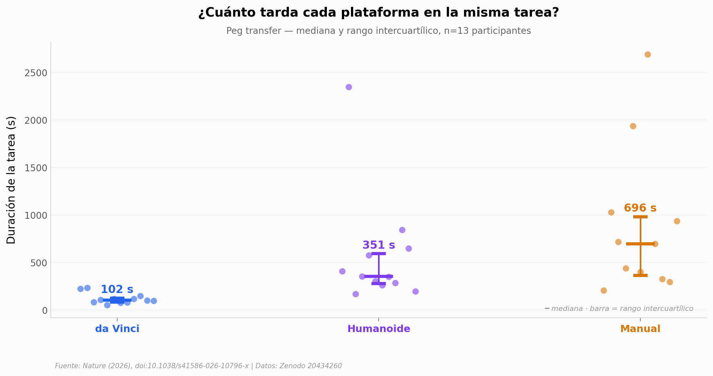

# Un robot humanoide operó en un laboratorio de cirugía. ¿Qué tan bien lo hizo?

Investigadores montaron un sistema de teleoperación sobre un humanoide comercial y le
pusieron las mismas dos pruebas del examen de laparoscopia (FLS) que hace un cirujano
para certificarse. Al lado corrieron el da Vinci —el robot quirúrgico dedicado— y la
laparoscopia manual. Exploramos los datos del *dry-lab* (18 y 13 participantes) para ver
qué tan cerca está un humanoide de propósito general del estándar quirúrgico.

**El hallazgo:** el humanoide es **~3,4× más lento que el da Vinci** en velocidad, pero
**~2× más rápido que la mano humana**, y su **precisión iguala a la del dVRK** (diferencia
de error no distinguible, p=0,72). Es un estudio de viabilidad técnica, no de eficacia clínica.

## Gráfica clave



## Reproducir

[](https://colab.research.google.com/github/Ciencia-a-Mordiscos/lab/blob/main/papers/2026-07-08-humanoides-cirugia-laparoscopica/notebook.ipynb)

O localmente:
```bash
pip install pandas matplotlib numpy scipy
jupyter execute notebook.ipynb
```

## Datos

- `datos/peg_transfer_data.csv` — Peg transfer: 13 participantes × 3 modalidades (da Vinci, humanoide, manual). Duración y errores.
- `datos/oring_transfer_data.csv` — O-ring transfer: 18 participantes × 3 plataformas (dVRK, humanoide, manual) × 6 intentos. Tiempo y 6 categorías de error ponderadas.

## Links

- **Video:** [Ver en YouTube](https://youtube.com/shorts/nhFdbk_UEOg)
- **Paper:** [Nature — DOI: 10.1038/s41586-026-10796-x](https://doi.org/10.1038/s41586-026-10796-x)
- **Datos originales:** [Zenodo 20434260](https://zenodo.org/records/20434260)
