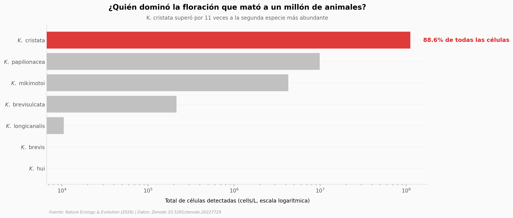

# Un millón de animales muertos: encontraron al culpable en el agua

En 2025, la costa de Australia del Sur sufrió una de las mayores mortandades marinas registradas: cerca de un millón de animales de más de 600 especies murieron a lo largo de 20.000 km² durante más de un año. Un equipo tomó 115 muestras de agua, contó por qPCR el ADN de siete algas del género *Karenia*, y aisló a la culpable para medir su veneno en el laboratorio.

**El hallazgo:** una especie nueva, ***Karenia cristata***, **dominó el 88,6% de todas las células** de *Karenia* del muestreo, y su toxina mata células de branquia a **~27 células por mililitro** — cuando el mar tenía, en la mediana, unas 12 veces más.

## Gráfica clave



## Reproducir

[](https://colab.research.google.com/github/Ciencia-a-Mordiscos/lab/blob/main/papers/2026-07-08-karenia-cristata-mortandad-marina/notebook.ipynb)

O localmente:
```bash
pip install pandas matplotlib numpy scipy
jupyter execute notebook.ipynb
```

## Datos

- `datos/abundancia_karenia_qpcr.csv` — abundancia celular (cells/L) por qPCR de 7 especies de *Karenia*, 115 muestras (36 sitios × 22 fechas), marzo–septiembre 2025.
- `datos/viabilidad_branquias_rtgill.csv` — viabilidad relativa de células de branquia de trucha (RTgill-W1) expuestas 2 h al sobrenadante de *K. cristata*, 8 concentraciones, n=40.
- `datos/mortalidad_invertebrados.csv` — mortalidad de rotíferos y *Artemia* en series de dilución; material de campo (WL) vs cultivo aislado (KC).

## Links

- **Video:** [Pendiente]
- **Paper:** [Nature Ecology & Evolution — DOI: 10.1038/s41559-026-03115-0](https://doi.org/10.1038/s41559-026-03115-0)
- **Datos originales:** [Zenodo — 10.5281/zenodo.20227729](https://doi.org/10.5281/zenodo.20227729)
