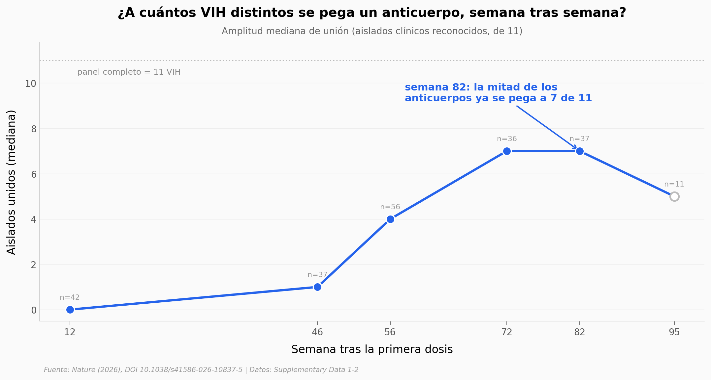

# Una vacuna hizo que monos fabricaran anticuerpos contra el VIH

Durante casi 40 años, ninguna vacuna había logrado que un animal normal produjera los anticuerpos raros que frenan muchas cepas de VIH a la vez. Un equipo probó la estrategia *germline-targeting* —guiar a las células B desde su versión más joven— en primates no humanos *outbred* (genéticamente diversos, como nosotros), y por primera vez funcionó de forma reproducible. Abrimos los datos de **unión** anticuerpo–virus que publicaron y seguimos cómo esos anticuerpos maduraron, a qué le apuntan y qué firma estructural comparten.

**El hallazgo:** en la semana 82, **la mitad de los anticuerpos ya se pegaba a 7 de los 11 VIH** del panel de prueba, y **el 98% (55 de 56) apuntaba al supersitio del glicano N332** —el epítopo que el diseño buscaba.

> ⚠️ Estos datos miden **unión** (afinidad SPR), no **neutralización**. Los porcentajes de neutralización del paper (hasta 67% de amplitud; bnAbs en ≥50% de los animales) viven en tablas del suplemento no públicas y **no** se reproducen aquí. La unión es el paso previo mecánico a neutralizar.

## Gráfica clave



## Reproducir

[](https://colab.research.google.com/github/Ciencia-a-Mordiscos/lab/blob/main/papers/2026-07-08-vacuna-hiv-anticuerpos-primates/notebook.ipynb)

O localmente:
```bash
pip install pandas matplotlib numpy
jupyter execute notebook.ipynb
```

## Datos

- `datos/kd_matrix.csv` — matriz Kd (SPR) larga: anticuerpo × inmunógeno, 3.348 mediciones, con semana/animal y flag de unión (<1 µM)
- `datos/amplitud_por_semana.csv` — amplitud (nº de aislados unidos) mediana/media por semana (12–95)
- `datos/union_por_aislado.csv` — % de anticuerpos maduros que unen cada uno de los 11 aislados clínicos
- `datos/control_n332.csv` — Kd pareado con/sin glicano N332 (control de especificidad de epítopo)
- `datos/cdr3_longitudes.csv` — longitud de la HCDR3 (aminoácidos) de 292 anticuerpos clase BG18 tipo I

## Links

- **Video:** [Pendiente]
- **Paper:** [Nature — DOI: 10.1038/s41586-026-10837-5](https://doi.org/10.1038/s41586-026-10837-5)
- **Datos originales:** [Supplementary Data 1–2 (mismo DOI)](https://doi.org/10.1038/s41586-026-10837-5)
