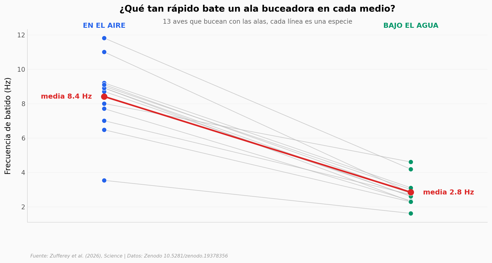

# Un ave que vuela y bucea con las mismas alas — pero cambia de marcha

Hay aves —frailecillos, araos, pingüinos— que usan las mismas alas para volar en el aire y "volar" bajo el agua. El agua es unas 800 veces más densa que el aire, así que un mismo ala no puede batir igual en ambos. ¿Cómo lo resuelven? Cambiando de marcha.

**El hallazgo:** **13 aves buceadoras baten sus alas 3 veces más lento bajo el agua (8,41 Hz en aire → 2,84 Hz en agua, d de Cohen = 3,2).** Un robot de alas batientes reproduce el principio: alas grandes suman sustentación en el aire sin perder casi empuje al nadar — aunque el robot todavía gasta ~10x más energía que un ave real.

## Gráfica clave



## Reproducir

[](https://colab.research.google.com/github/Ciencia-a-Mordiscos/lab/blob/main/papers/2026-07-09-leaping-out-water-flapping-wings/notebook.ipynb)

O localmente:
```bash
pip install pandas matplotlib numpy scipy
jupyter execute notebook.ipynb
```

## Datos

- `datos/flapping_frequency_animals.csv` — frecuencia de batido en aire y agua, 36 animales buceadores (13 wing-propelled pareados).
- `datos/wingsize_flight_forces_power.csv` — robot en vuelo: sustentación, arrastre y potencia por envergadura (33/43/53) y frecuencia.
- `datos/wingsize_swim_power.csv` — robot nadando: empuje por ciclo por envergadura.
- `datos/cost_of_transport_animals.csv` — costo de transporte (J/Nm) de animales y del robot, en aire y agua.

## Links

- **Video:** [Pendiente]
- **Paper:** [Science — DOI: 10.1126/science.aeb6744](https://doi.org/10.1126/science.aeb6744)
- **Datos originales:** [Zenodo 10.5281/zenodo.19378356](https://doi.org/10.5281/zenodo.19378356)
