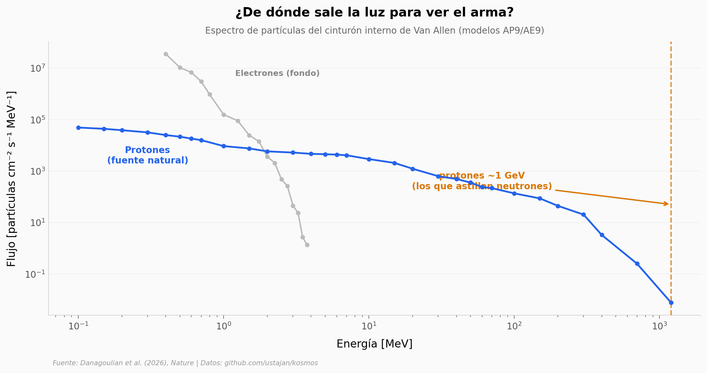

# Verificación del Tratado del Espacio Exterior con protones cósmicos

¿Cómo detectas un arma nuclear escondida en un satélite sin abrirlo? Este paper propone usar algo que ya está ahí arriba: los protones de casi 1 GeV atrapados en el cinturón interno de Van Allen. Cuando golpean el material de una ojiva, le arrancan neutrones por *spallation* — y un detector del tamaño de un CubeSat 9U podría verlos.

**El hallazgo:** En simulación, un CubeSat 9U identificaría un arma termonuclear a **4 km en ~1 semana** (7,25 días); con una constelación de **10 CubeSats, en 17 horas**. Es un estudio conceptual y de viabilidad — ningún detector ha volado todavía.

## Gráfica clave



## Reproducir

[](https://colab.research.google.com/github/Ciencia-a-Mordiscos/lab/blob/main/papers/2026-07-09-verificacion-tratado-espacial-neutrones/notebook.ipynb)

O localmente:
```bash
pip install pandas matplotlib numpy
jupyter execute notebook.ipynb
```

## Datos

- `datos/diff.AP9.output_mean_flux.AP9_i316.tsv` — espectro de flujo de protones (modelo AP9/Irene), 32 puntos, 0,1–2000 MeV.
- `datos/neutron_spallation.tsv` — espectro de neutrones por spallation (Geant4), 42 puntos, pico a 0,15 MeV.
- `datos/diff.AE9.output_mean_flux.AE9_i316.tsv` — espectro de flujo de electrones de fondo (modelo AE9/Irene), 17 puntos, 0,4–3,75 MeV.

## Links

- **Video:** [Ver en YouTube](https://youtube.com/shorts/8gzX809Zmz4)
- **Paper:** [Nature — DOI: 10.1038/s41586-026-10783-2](https://doi.org/10.1038/s41586-026-10783-2)
- **Datos originales:** [github.com/ustajan/kosmos](https://github.com/ustajan/kosmos)
