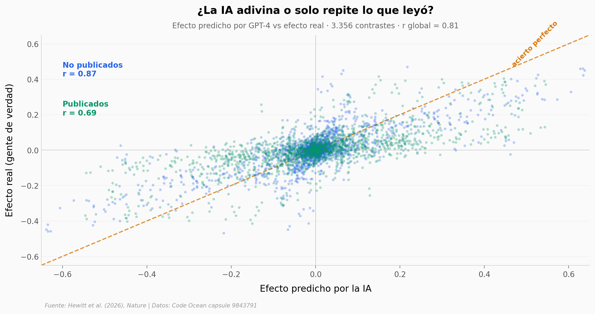

# ¿Puede una IA adivinar cómo reaccionará la gente antes de preguntarle?

Un equipo le pidió a GPT-4 que predijera el resultado de 70 experimentos sociales reales —sin correr ninguno, solo leyendo el diseño. Sus predicciones se parecieron a la realidad tanto como las de un grupo de humanos expertos. Abrimos los datos (3.356 contrastes, 469 efectos, 119.330 participantes) para ver exactamente cuánto acertó y dónde falló.

**El hallazgo:** **GPT-4 predice el efecto de un experimento social con r ≈ 0,85 (0,92 ajustado), a la altura de pronósticos humanos —pero sobreestima el tamaño de los efectos un 39% en promedio.**

## Gráfica clave



## Reproducir

[](https://colab.research.google.com/github/Ciencia-a-Mordiscos/lab/blob/main/papers/2026-07-10-llm-predice-experimentos-sociales/notebook.ipynb)

O localmente:
```bash
pip install pandas matplotlib numpy scipy
jupyter execute notebook.ipynb
```

## Datos

- `datos/predicciones_vs_reales.csv` — efecto real vs predicho por GPT-4 para 3.356 contrastes, etiquetados publicado/no publicado (headline scatter).
- `datos/correlacion_por_modelo.csv` — correlación (cruda y ajustada, con IC 95%) por modelo: GPT-4, GPT-3.5, humanos, modelos abiertos, davinci-002.
- `datos/gpt_vs_expertos_megastudias.csv` — archivo secundario: r de GPT vs expertos en 15 megastudios de campo.

## Links

- **Video:** [Ver en YouTube](https://youtube.com/shorts/Ns4vzkaMfO8)
- **Paper:** [Nature — DOI: 10.1038/s41586-026-10742-x](https://doi.org/10.1038/s41586-026-10742-x)
- **Datos originales:** [Code Ocean capsule 9843791](https://codeocean.com/capsule/9843791/tree/v1)
