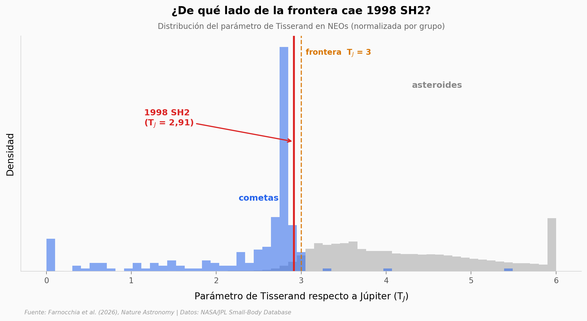

# El asteroide que era un cometa disfrazado

**875163 (1998 SH2)** está catalogado como asteroide potencialmente peligroso, pero su órbita se desvía año tras año como si algo la empujara desde adentro. Dos pistas dinámicas — medibles desde la Tierra — lo delatan como cometa: su órbita cae del lado cometario de la frontera clásica, y tiene una aceleración no-gravitacional 10 veces mayor que la de una roca típica.

**El hallazgo:** con un parámetro de Tisserand **T_J = 2,91** (bajo la frontera de 3) y una aceleración no-gravitacional **|A₂| = 6,96·10⁻¹³ au/día²** ajustada a 14σ, 1998 SH2 se comporta como un **cometa débil** — y no es el único: **2.120 de 42.007** "asteroides" cercanos (5,05%) tienen órbita de cometa.

## Gráfica clave



## Reproducir

[](https://colab.research.google.com/github/Ciencia-a-Mordiscos/lab/blob/main/papers/2026-07-10-neo-1998-sh2-cometa/notebook.ipynb)

O localmente:
```bash
pip install pandas matplotlib numpy
jupyter execute notebook.ipynb
```

## Datos

- `datos/neo_asteroides.csv` — 42.007 NEOs clasificados asteroide (elementos orbitales + A₁/A₂/A₃ + T_J calculado)
- `datos/neo_cometas.csv` — 208 NEOs clasificados cometa (mismos campos)
- `datos/objeto_1998_sh2.csv` — registro full-precision de 1998 SH2 (orbit_id 72, A₂ ajustado, SNR 14,2)

## Links

- **Video:** [Pendiente]
- **Paper:** [Nature Astronomy — DOI: 10.1038/s41550-026-02913-7](https://doi.org/10.1038/s41550-026-02913-7)
- **Datos originales:** [NASA/JPL Small-Body Database](https://ssd-api.jpl.nasa.gov/doc/sbdb_query.html)
