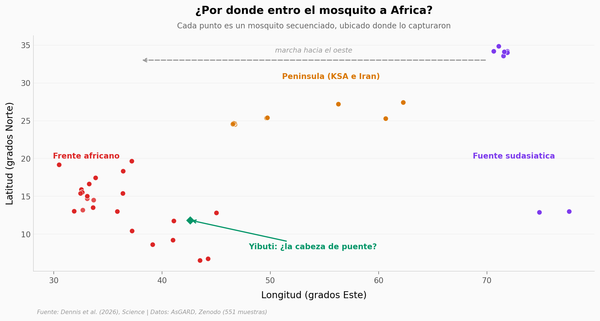

# Un mosquito cruzó un océano de ciudades

*Anopheles stephensi* no es africano: es un mosquito de malaria asiático que cría en el agua almacenada de las ciudades. Un equipo secuenció 645 genomas completos por África, Medio Oriente y Asia para reconstruir su invasión. Nosotros abrimos su tabla de muestreo —551 mosquitos con país, coordenadas y fecha— y dibujamos la **geografía** de esa expansión.

**El hallazgo:** los mosquitos secuenciados se reparten en **tres bloques** —fuente sudasiática (58), Península Arábiga e Irán (117) y frente africano (376)— con un gradiente de longitud de **72,5 → 55,6 → 37,3 °E**: la huella espacial que la reconstrucción genómica del paper lee como el sentido de la invasión.

## Gráfica clave



## Reproducir

[](https://colab.research.google.com/github/Ciencia-a-Mordiscos/lab/blob/main/papers/2026-07-10-stephensi-mosquito-invasor-africa/notebook.ipynb)

O localmente:
```bash
pip install pandas matplotlib numpy
jupyter execute notebook.ipynb
```

## Datos

- `datos/muestras_stephensi.csv` — 551 mosquitos secuenciados; país, coordenadas lat/lon, población de análisis, super-población, fecha de colecta y flag de control de calidad. Rango 2005–2023.

## Qué NO reproduce este notebook

Los genotipos crudos (SNP/CNV) están embargados en ENA/MalariaGEN. Por eso el notebook cubre la **geografía y composición del muestreo**, no la genética de poblaciones (Fst, admixture) ni las frecuencias de resistencia a insecticidas del paper.

## Links

- **Video:** [Pendiente]
- **Paper:** [Science — DOI: 10.1126/science.adx6925](https://doi.org/10.1126/science.adx6925)
- **Datos originales:** [Repositorio AsGARD en Zenodo](https://doi.org/10.5281/zenodo.19324618)
