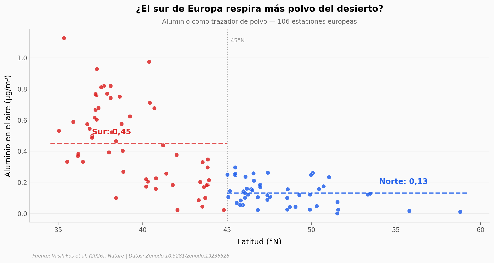

# Rising dust pollution across Europe — el polvo del desierto que respira Europa

El polvo del Sáhara no se queda en el desierto: el viento lo empuja miles de kilómetros hasta Europa. Este notebook abre los datos de 106 estaciones europeas y un núcleo de hielo alpino para ver dónde llega más polvo y cómo ha cambiado desde 1750.

**El hallazgo:** El sur de Europa carga **3,45 veces** más trazador de polvo que el norte, y un núcleo de hielo alpino muestra que el polvo **aumentó +114 %** (raw) desde la era preindustrial — consistente con el +110 % del paper — asociado a la sequía del norte de África (ρ = −0,78).

## Gráfica clave



## Reproducir

[](https://colab.research.google.com/github/Ciencia-a-Mordiscos/lab/blob/main/papers/2026-07-15-dust-pollution-europa/notebook.ipynb)

O localmente:

```bash
pip install pandas matplotlib numpy scipy
jupyter execute notebook.ipynb
```

## Datos

- `datos/gradiente_sitios.csv` — 106 estaciones europeas: latitud, longitud, aluminio medio (µg/m³, trazador de polvo), nº de datos.
- `datos/icecore_ca.csv` — núcleo de hielo alpino: 271 años (1750–2020) de calcio (ppb), crudo y suavizado a 20 años.
- `datos/sequia_polvo.csv` — calcio suavizado del hielo vs índice de sequía marroquí PDSI, 1880–2018.
- `datos/ciclo_estacional.csv` — ciclo estacional del polvo (medias mensuales normalizadas).

## Links

- **Video:** [Ver en YouTube](https://youtube.com/shorts/Qste9Es84uI)
- **Paper:** [Nature — DOI: 10.1038/s41586-026-10743-w](https://doi.org/10.1038/s41586-026-10743-w)
- **Datos originales:** [Zenodo 10.5281/zenodo.19236528](https://doi.org/10.5281/zenodo.19236528)
