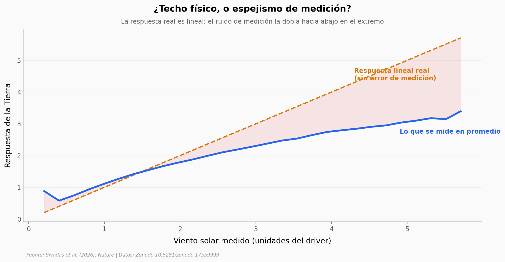

# El techo que no existe: regresión a la media en las tormentas solares

Durante casi 40 años, la respuesta magnética de la Tierra al viento solar parecía chocar contra un techo invisible cuando el empuje era extremo. Los físicos lo llamaron *saturación* y propusieron una decena de teorías. Este re-análisis muestra que ese techo nunca existió: es un espejismo estadístico llamado **regresión a la media**, que aparece al medir valores extremos con instrumentos imprecisos.

**El hallazgo:** una respuesta perfectamente **lineal** más un error de medición realista basta para reproducir la saturación aparente. Corregido el sesgo, el impacto de las tormentas extremas **podría acercarse al doble** de lo estimado.

## Gráfica clave



## Reproducir

[](https://colab.research.google.com/github/Ciencia-a-Mordiscos/lab/blob/main/papers/2026-07-15-regresion-media-geomagnetica/notebook.ipynb)

O localmente:

```bash
pip install pandas matplotlib numpy scipy
jupyter execute notebook.ipynb
```

## Datos

- `datos/curva_regresion_media.csv` — curva E[respuesta verdadera | driver medido] vs. identidad, reproducida por Monte Carlo (Code 4 del repo archivado, semilla 42). 29 tramos de driver, 198.000 muestras.
- `datos/saturacion_estudios.csv` — 9 estudios de saturación (1981–2005) con su límite reportado en mV/m (Extended Data Table 2).

## Links

- **Video:** [Pendiente]
- **Paper:** [Nature — DOI: 10.1038/s41586-026-10757-4](https://doi.org/10.1038/s41586-026-10757-4)
- **Datos originales:** [Código archivado (Zenodo)](https://doi.org/10.5281/zenodo.17559999)
