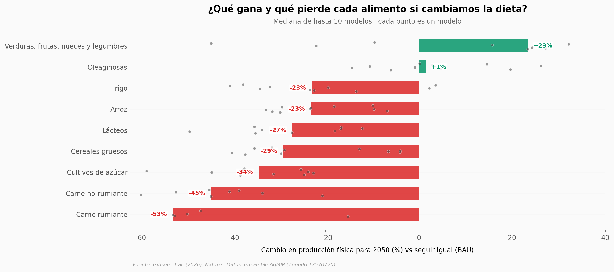

# Si el mundo comiera sano, ¿qué le pasaría al campo?

Si el planeta adoptara una dieta saludable y sostenible, mejorara la productividad agrícola y redujera a la mitad el desperdicio de comida, un ensamble de diez modelos económicos globales proyecta para 2050 una reestructuración profunda de la agricultura: mucha menos ganadería, más verduras y legumbres, y menos tierra y producción totales. No es un pronóstico inevitable — depende de las políticas que empujen esa transformación.

**El hallazgo:** bajo el escenario de transformación, la producción de carne de rumiantes cae una mediana de **−53 %** vs seguir igual, mientras verduras, frutas, nueces y legumbres suben **+23 %** y la producción agrícola total baja **~17 %**.

## Gráfica clave



## Reproducir

[](https://colab.research.google.com/github/Ciencia-a-Mordiscos/lab/blob/main/papers/2026-07-15-transformacion-sistemas-alimentarios/notebook.ipynb)

O localmente:
```bash
pip install pandas matplotlib numpy
jupyter execute notebook.ipynb
```

## Datos

- `datos/produccion_sector_modelo.csv` — cambio % de producción física vs BAU 2050, por sector alimentario × modelo (10 sectores × 9-10 modelos, 95 filas).
- `datos/tierra_agricola_modelo.csv` — cambio % de tierra agrícola vs 2020 y vs BAU, EL2 2050, por modelo (n=5).
- `datos/trayectoria_produccion_agr.csv` — trayectoria 2020-2050 de producción agrícola total, por modelo × año × escenario (BAU y EL2).

Agregados en el servidor desde el archivo crudo (`manuscript_data_upload_101125.csv`, 31,8 MB, 407.394 filas), preservando el ensamble a nivel de modelo para reproducibilidad.

## Links

- **Video:** [Pendiente]
- **Paper:** [Nature — DOI: 10.1038/s41586-026-10775-2](https://doi.org/10.1038/s41586-026-10775-2)
- **Datos originales:** [Zenodo (records/17570720)](https://zenodo.org/records/17570720)
