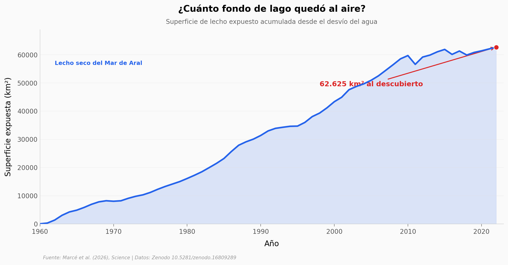

# El Mar de Aral se secó y empezó a exhalar carbono

Cuando el cuarto lago más grande del mundo se secó, su lecho no se quedó quieto: el barro expuesto —cargado de milenios de materia orgánica— empezó a soltar CO₂ al aire. Un equipo midió cuánto, sitio por sitio, y rehízo la cuenta del carbono de toda una región.

**El hallazgo:** desde 1960, el lecho seco del Mar de Aral ha liberado **unos 204 Tg C (±53)**, convirtiendo la cuenca de un sumidero presunto en una **fuente neta de carbono**.

## Gráfica clave



## Reproducir

[](https://colab.research.google.com/github/Ciencia-a-Mordiscos/lab/blob/main/papers/2026-07-16-mar-aral-carbono/notebook.ipynb)

O localmente:

```bash
pip install pandas matplotlib numpy scipy
jupyter execute notebook.ipynb
```

## Datos

- `datos/flujo_co2_sitios.csv` — 111 mediciones de flujo de CO₂ (IRGA) en 14 sitios, condiciones Clear/Dark (sep 2022).
- `datos/desecacion_area.csv` — área de lecho expuesto acumulada por año, 1960-2022 (km²).
- `datos/reflooding_escenarios.csv` — 4 escenarios de reinundación: agua devuelta vs CO₂ evitado.
- `datos/carbono_organico_sedimento.csv` — 554 muestras de carbono orgánico del sedimento (%).

## Links

- **Video:** [Ver en YouTube](https://youtube.com/shorts/jbBLsiJrj5k)
- **Paper:** [Science — DOI: 10.1126/science.aeb2344](https://doi.org/10.1126/science.aeb2344)
- **Datos originales:** [Zenodo 10.5281/zenodo.16809289](https://doi.org/10.5281/zenodo.16809289)
