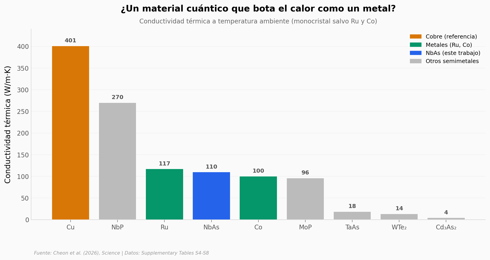

# Un cable que mejora al encogerse

Cada cable de cobre dentro de un chip empeora al adelgazarlo: los electrones rebotan contra las paredes y la resistencia sube. Un equipo probó lo contrario con nanohilos de arseniuro de niobio (NbAs), un semimetal de Weyl. Al encoger el hilo hasta 40 nanómetros, la resistividad **bajó**.

**El hallazgo:** un nanohilo de NbAs de 40 nm alcanza **10,5 ± 1,9 µΩ·cm**, ~**70 % menos** que el mismo material en bloque. Y, de paso, conduce el calor como un metal (109,68 W/m·K, en la liga del rutenio y el cobalto).

## Gráfica clave



## Reproducir

[](https://colab.research.google.com/github/Ciencia-a-Mordiscos/lab/blob/main/papers/2026-07-16-nbas-nanowires-interconnects/notebook.ipynb)

O localmente:
```bash
pip install pandas matplotlib numpy
jupyter execute notebook.ipynb
```

## Datos

Transcritos de las tablas del material suplementario (mismo DOI):

- `datos/conductividad_termica_materiales.csv` — conductividad térmica de 16 materiales (metales y semimetales topológicos), Tabla S7.
- `datos/densidad_corriente_ruptura.csv` — corriente de ruptura de 14 conductores nanoscópicos, Tabla S5.
- `datos/composicion_edx.csv` — proporción atómica Nb:As de bulk + 4 nanohilos (EDX), Tabla S4.
- `datos/dielectricos_low_k.csv` — dieléctricos low-k para gestión térmica del chip, Tabla S8.

## Límites honestos

- La curva resistividad-vs-diámetro (el hallazgo central) vive en una figura del paper paywalled; aquí se cita del abstract, no se re-mide.
- El mecanismo de "conducción dominada por la superficie" lo atribuyen cálculos DFT, no una medición directa.
- El cobre todavía supera al NbAs en corriente de ruptura y en conductividad térmica absoluta. La ventaja del NbAs está en la resistividad a diámetros pequeños.

## Links

- **Video:** [Pendiente]
- **Paper:** [Science — DOI: 10.1126/science.adx3027](https://doi.org/10.1126/science.adx3027)
- **Datos originales:** [Material suplementario (Science)](https://www.science.org/doi/suppl/10.1126/science.adx3027/suppl_file/science.adx3027_sm.pdf)
