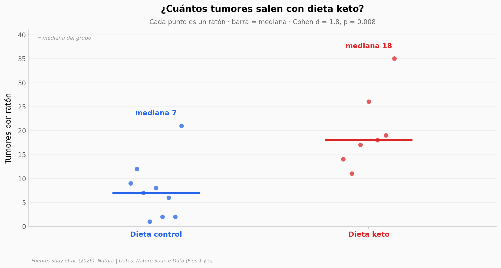

# La dieta keto aceleró los tumores intestinales — y no fueron las cetonas

En ratones genéticamente propensos a los pólipos intestinales (el modelo de la poliposis adenomatosa familiar), una dieta cetogénica multiplicó los tumores, los hizo más grandes y acortó la supervivencia. Pero cuando el equipo apagó las cetonas —el sello de la dieta keto— los tumores no cambiaron. El acelerador real era la oxidación de las grasas de la dieta.

**El hallazgo:** bajo dieta keto, **mediana de 18 tumores por ratón contra 7 con dieta control (~2,6x)**, con área tumoral ~4x mayor. Apagar la enzima CPT1A (la puerta de la quema de grasas) bajo la misma dieta llevó la supervivencia al **100%** (0 eventos) frente al 25% de mortalidad en los controles.

## Gráfica clave



## Reproducir

[](https://colab.research.google.com/github/Ciencia-a-Mordiscos/lab/blob/main/papers/2026-07-17-keto-tumores/notebook.ipynb)

O localmente:
```bash
pip install pandas matplotlib numpy scipy
jupyter execute notebook.ipynb
```

## Datos

- `datos/fig1b_bhb.csv` — β-hidroxibutirato (cetona) KD vs CD, valida la cetosis (7 vs 5).
- `datos/fig1i_tumor_number.csv` — nº de tumores por ratón, KD vs CD (7 vs 9).
- `datos/fig1j_tumor_area.csv` — área tumoral total, KD vs CD (7 vs 9).
- `datos/fig1h_survival.csv` — supervivencia (días, evento) CD vs KD (47 ratones).
- `datos/fig5i_tumor_number_cpt1a.csv` — nº de tumores bajo KD: WT vs Cpt1a-iKO (12 vs 30).
- `datos/fig5h_tumor_area_cpt1a.csv` — área tumoral bajo KD: WT vs Cpt1a-iKO (12 vs 30).
- `datos/fig5g_survival_cpt1a.csv` — supervivencia bajo KD: WT vs Cpt1a-iKO (46 ratones).

## Links

- **Video:** [Ver en YouTube](https://youtube.com/shorts/P9dAbmAofq0)
- **Paper:** [Nature — DOI: 10.1038/s41586-026-10779-y](https://doi.org/10.1038/s41586-026-10779-y)
- **Datos originales:** [Nature Source Data (Figs 1 y 5)](https://doi.org/10.1038/s41586-026-10779-y)
