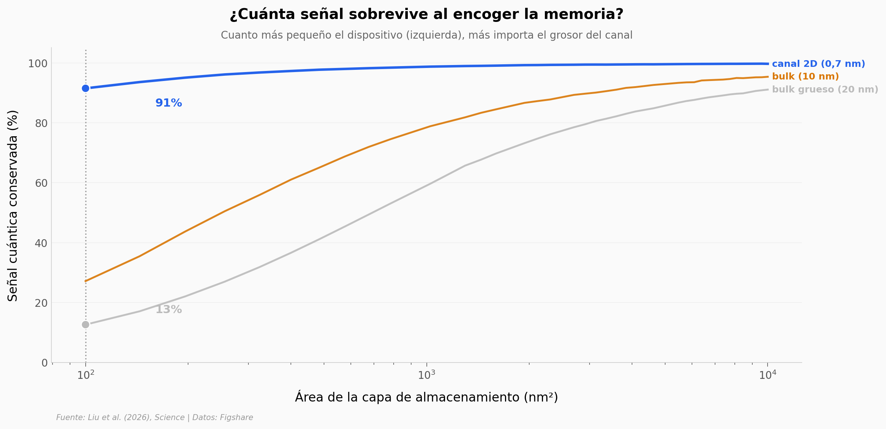

# Una memoria hecha de un solo electrón

Un equipo construyó una memoria que guarda información moviendo **un único electrón**. El truco para lograrlo a escala diminuta fue una estructura 2D coplanar (drenaje, canal y fuente en el mismo plano) que suprime la capacitancia de borde — el efecto que, al miniaturizar, normalmente ahoga la señal de un solo electrón.

**El hallazgo:** cambiar **un electrón** desplaza el voltaje umbral de la memoria **~0,5 V** de forma no volátil, con una señal por electrón **~14× mayor** que la de dispositivos bulk industriales.

## Gráfica clave



## Reproducir

[](https://colab.research.google.com/github/Ciencia-a-Mordiscos/lab/blob/main/papers/2026-07-18-memoria-un-electron-cuantica/notebook.ipynb)

O localmente:
```bash
pip install pandas matplotlib numpy
jupyter execute notebook.ipynb
```

## Datos

- `datos/senal_vs_area.csv` — Fig 1d: señal cuántica (%) vs área de almacenamiento, para 3 grosores de canal (0,7 / 10 / 20 nm). 114 puntos.
- `datos/escalera_electron.csv` — Fig 2d: ΔVth (V\*, normalizado) vs voltaje de programación, operaciones quitar/añadir electrón. 30 puntos.
- `datos/retencion.csv` — Fig 3b: Vth de los estados N(0)…N(-3) en V\* vs tiempo (1–5.000 s). 5 puntos.
- `datos/benchmark.csv` — Fig 3c: |ΔVth cuántico| físico (V) vs área, comparando bulk industrial, bulk nanomaterial y canal 2D. 21 puntos.

## Links

- **Video:** [Ver en YouTube](https://youtube.com/shorts/8hHPh9yF6wM)
- **Paper:** [Science — DOI: 10.1126/science.aeg6638](https://doi.org/10.1126/science.aeg6638)
- **Datos originales:** [Figshare](https://doi.org/10.6084/m9.figshare.32483589.v1)
