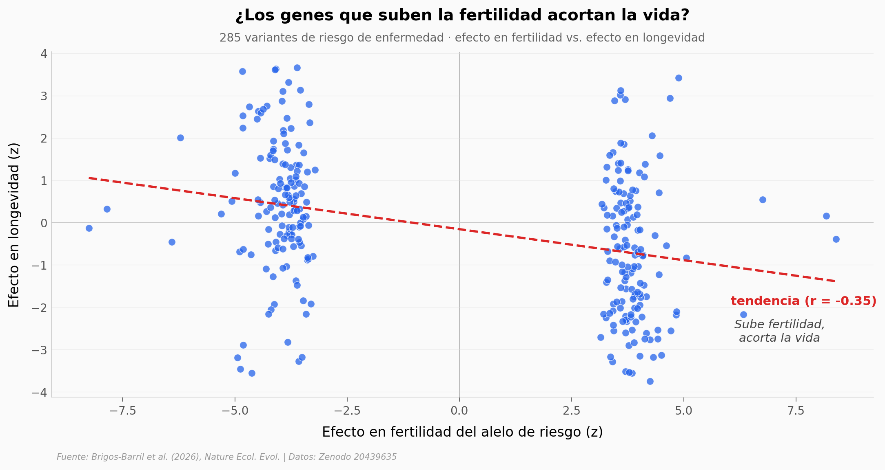

# Los genes que nos enferman... y por qué la evolución no los borra

Miles de variantes genéticas que suben el riesgo de enfermedad siguen entre nosotros generación tras generación. Este notebook explora, con los datos del propio estudio, por qué la selección natural no las elimina: porque las mismas variantes que enferman también tienden a subir la fertilidad. Es un **canje evolutivo** (pleiotropía antagónica).

**El hallazgo:** entre 285 alelos de riesgo, los que más suben la fertilidad son los que más recortan la longevidad (**r = −0,35**, n = 285). Y el coste reproductivo solo aparece en las enfermedades de aparición temprana.

## Gráfica clave



## Reproducir

[](https://colab.research.google.com/github/Ciencia-a-Mordiscos/lab/blob/main/papers/2026-07-21-genetic-tradeoffs-fertility-longevity/notebook.ipynb)

O localmente:
```bash
pip install pandas matplotlib numpy scipy
jupyter execute notebook.ipynb
```

## Datos

- `datos/tradeoff_loci.csv` — 285 loci pleiotrópicos: efecto en fertilidad (z) y en longevidad (z).
- `datos/childlessness_by_onset.csv` — 62 enfermedades: % sin hijos en afectados vs no afectados, con edad típica de aparición.
- `datos/seleccion_sds.csv` — 293 alelos con SDS (señal de selección reciente) del alelo que aumenta la fertilidad.
- `datos/mr_results.csv` — randomización mendeliana: efecto causal de la predisposición a la enfermedad sobre longevidad y fertilidad.

## Links

- **Video:** [Pendiente]
- **Paper:** [Nature Ecology & Evolution — DOI: 10.1038/s41559-026-03140-z](https://doi.org/10.1038/s41559-026-03140-z)
- **Datos originales:** [Zenodo 20439635](https://doi.org/10.5281/zenodo.20439635)
