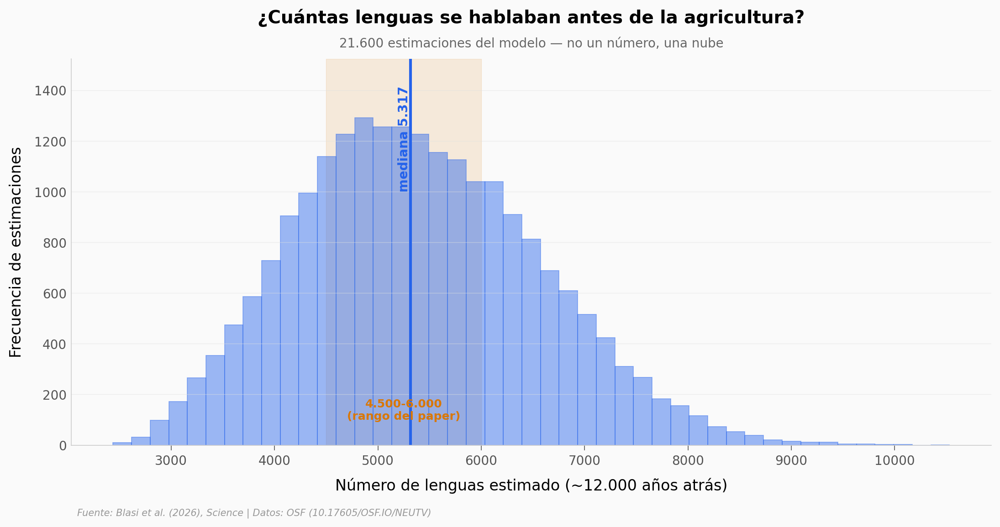

# Antes de sembrar la primera semilla, el mundo hablaba menos idiomas que hoy

Un equipo cruzó modelado estadístico, datos de 339 sociedades cazadoras-recolectoras y paleodemografía para estimar cuántas lenguas se hablaban antes de la agricultura. Abrimos sus datos y reconstruimos las piezas reproducibles.

**El hallazgo:** hace ~12.000 años había entre **4.500 y 6.000 lenguas** (nuestra mediana: **5.317**), frente a las ~7.500 de hoy. El salto no es "el doble" — es apenas **1,4 veces**.

## Gráfica clave



## Reproducir

[](https://colab.research.google.com/github/Ciencia-a-Mordiscos/lab/blob/main/papers/2026-07-23-lenguas-diversidad-holoceno/notebook.ipynb)

O localmente:
```bash
pip install pandas matplotlib numpy
jupyter execute notebook.ipynb
```

## Datos

- `datos/early_holocene_languages.csv` — 21.600 estimaciones Monte-Carlo del número de lenguas ~12 kybp (8 escenarios de modelado).
- `datos/scenarios_summary.csv` — resumen por escenario (mediana + IC 95%), 8 filas.
- `datos/global_population.csv` — trayectoria de población global −10000 a 2017 con banda de incertidumbre, 75 puntos.
- `datos/fpca_variance.csv` — varianza explicada por componente del FPCA sobre las trayectorias de diversidad.

## Links

- **Video:** [Pendiente]
- **Paper:** [Science — DOI: 10.1126/science.adx4343](https://doi.org/10.1126/science.adx4343)
- **Datos originales:** [OSF — 10.17605/OSF.IO/NEUTV](https://doi.org/10.17605/OSF.IO/NEUTV)
