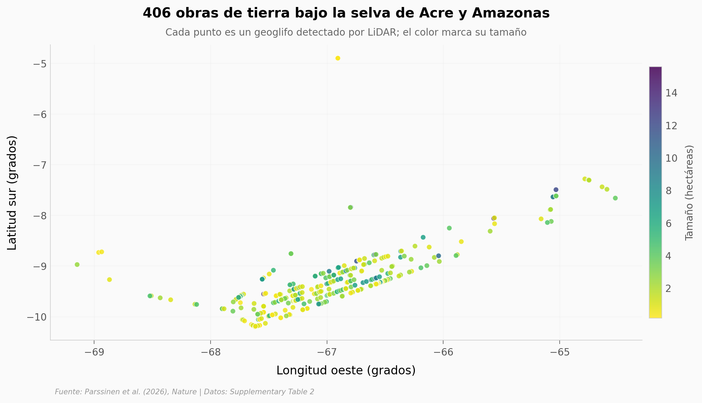

# Más de 20.000 obras de tierra bajo la selva amazónica

Un LiDAR aerotransportado voló 4.430 km sobre el suroeste de la Amazonía y, al "quitar" el bosque, dejó al descubierto una civilización precolonial de constructores: zanjas, terraplenes y recintos geométricos que llevaban siglos escondidos bajo las copas.

**El hallazgo:** **406 geoglifos catalogados en una sola campaña — tantos como los que antes se estimaban para TODA la Amazonía**, con una extrapolación a más de 20.000 en la región.

## Gráfica clave



## Reproducir

[](https://colab.research.google.com/github/Ciencia-a-Mordiscos/lab/blob/main/papers/2026-07-29-geoglifos-amazonia-lidar/notebook.ipynb)

O localmente:
```bash
pip install pandas matplotlib numpy scipy
jupyter execute notebook.ipynb
```

## Datos

- `datos/geoglifos_amazonia.csv` — 406 geoglifos del catálogo público (Supplementary Table 2): coordenadas, tamaño (ha), calidad de contorno y definición Aquiry. Tamaño mediano 2,12 ha (rango 0,16–15,59 ha).

## Links

- **Video:** [Ver en YouTube](https://youtube.com/shorts/HhgT95SP8h4)
- **Paper:** [Nature — DOI: 10.1038/s41586-026-10835-7](https://doi.org/10.1038/s41586-026-10835-7)
- **Datos originales:** [Nature Supplementary Information (Supplementary Table 2)](https://doi.org/10.1038/s41586-026-10835-7)
