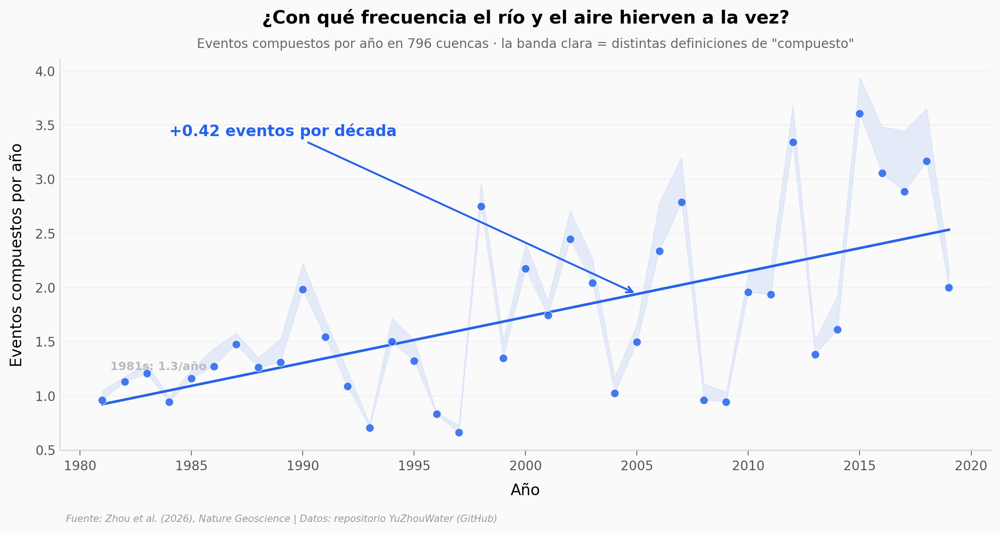

# Cuando el río y el aire se recalientan el mismo día

En 796 cuencas de ríos de Estados Unidos y Europa Central, que una ola de calor atmosférica y una fluvial ocurran **al mismo tiempo** pasó de rareza a algo casi tres veces más frecuente en cuatro décadas. El agua de los ríos se está recalentando mucho más rápido que el aire que la rodea.

**El hallazgo:** Los eventos compuestos río-aire suben **~0,40 eventos por década** (1981-2019), y las olas de calor fluviales se intensificaron **+114% en frecuencia, +148% en duración y +95% en intensidad** — muy por encima del **+27% / +33% / +22%** de las atmosféricas.

## Gráfica clave



## Reproducir

[](https://colab.research.google.com/github/Ciencia-a-Mordiscos/lab/blob/main/papers/2026-07-30-olas-calor-compuestas-rios/notebook.ipynb)

O localmente:
```bash
pip install pandas matplotlib numpy
jupyter execute notebook.ipynb
```

## Datos

- `datos/AHW_RHW_metric.csv` — métricas anuales 1981-2019 (39 años) de olas de calor atmosféricas (AHW) y fluviales (RHW): frecuencia, duración, intensidad.
- `datos/ARCH_frequency_by_time_gap.csv` — frecuencia anual de eventos compuestos bajo 6 definiciones de solape (gap1..gap20) = prueba de sensibilidad.
- `datos/Future_heatwave_duration.csv` — proyección 1981-2100 de duración media bajo SSP2-4.5 y SSP5-8.5.
- `datos/attribute_data.csv` — 65 atributos estáticos por cuenca (clima, topografía, hidrología) para las 796 cuencas.

## Links

- **Video:** [Ver en YouTube](https://youtube.com/shorts/X31pkRbLUL8)
- **Paper:** [Nature Geoscience — DOI: 10.1038/s41561-026-02040-y](https://doi.org/10.1038/s41561-026-02040-y)
- **Datos originales:** [Repositorio YuZhouWater (GitHub)](https://github.com/YuZhouWater/atmospheric-riverine-compound-heatwaves)
