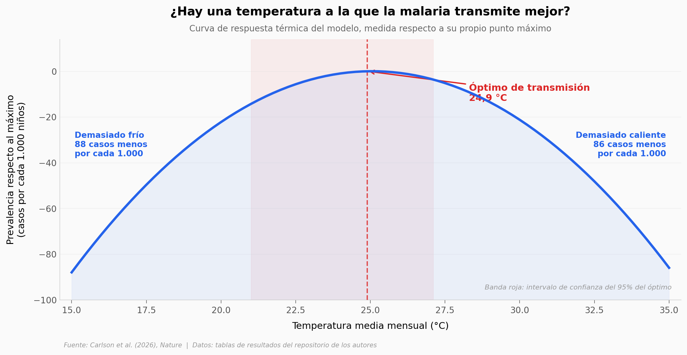

# ¿El cambio climático ya subió la malaria infantil en África?

Durante décadas se discutió si el calentamiento ya había cambiado la carga de malaria
en niños africanos. Carlson y su equipo juntaron 50.425 encuestas clínicas de 1900 a
2016 y corrieron un modelo que separa el efecto del clima del de todo lo demás. La
respuesta no es que subió ni que bajó: es que **se movió de sitio**. El calor empujó
la malaria hacia arriba en el sur y el este de África, y hacia abajo en el oeste —
justo donde la carga es más alta.

**El hallazgo:** el impacto histórico neto sobre el continente es de **+0,73 casos por
cada 1.000 niños**, con un intervalo de confianza del 95% de **-4,11 a +5,99** — cruza
el cero. Los cinco intervalos regionales lo cruzan. El paper mismo dice *probablemente*.

## Gráfica clave



El mosquito tiene una temperatura favorita. Por eso el mismo grado de más sube la
malaria en un sitio y la baja en otro — y por eso, bajo emisiones altas, el modelo
proyecta **menos** malaria a fin de siglo: África Occidental se calienta por encima
de lo que el parásito aguanta.

## Reproducir

[](https://colab.research.google.com/github/Ciencia-a-Mordiscos/lab/blob/main/papers/2026-07-31-clima-malaria-infantil-africa/notebook.ipynb)

O localmente:

```bash
pip install pandas matplotlib numpy
jupyter execute notebook.ipynb
```

## Datos

Los siete CSV salen de las tablas de resultados publicadas en el repositorio de código
de los autores (los valores reproducen las cifras del resumen del paper).

- `datos/atribucion_historica.csv` — impacto histórico atribuido, 5 regiones, con IC 95%
- `datos/proyecciones_futuro.csv` — 5 regiones × 3 escenarios SSP × 2 periodos (30 filas)
- `datos/beneficio_mitigacion.csv` — SSP2-RCP4.5 menos SSP1-RCP2.6, 4 regiones × 2 periodos
- `datos/coeficientes_robustez.csv` — coeficientes bajo 6 niveles de agrupamiento de errores
- `datos/sensibilidad_fuente_climatica.csv` — coeficientes con CRU vs ERA5
- `datos/impacto_mensual.csv` — mes de máximo impacto por región
- `datos/curva_termica.csv` — **derivado por nosotros**: curva de respuesta térmica
  reconstruida de los coeficientes publicados, relativa a su propio máximo (81 puntos)

## Links

- **Video:** [Pendiente]
- **Paper:** [Nature — DOI: 10.1038/s41586-026-10840-w](https://doi.org/10.1038/s41586-026-10840-w) · acceso abierto (CC-BY 4.0)
- **Datos originales:** [cjcarlson/falciparum](https://github.com/cjcarlson/falciparum) ·
  [Zenodo (11,8 GB, no descargado)](https://doi.org/10.5281/zenodo.20399793)
