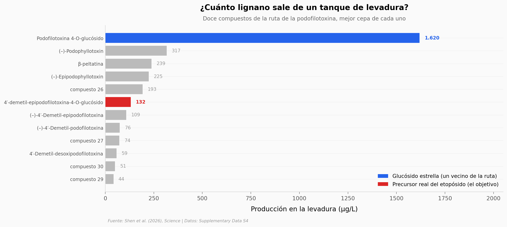

# Fabricar un medicamento contra el cáncer en levadura

El etopósido y el tenipósido son medicamentos esenciales contra el cáncer, pero su precursor solo lo produce una planta del Himalaya en peligro de extinción. Un equipo reconstruyó esa ruta biosintética dentro de la levadura de cerveza — más de 60 ediciones genéticas y 45 enzimas — para fabricar el precursor en un tanque.

**El hallazgo:** la levadura ya produce **12 lignanos distintos** de la ruta de la podofilotoxina; el glucósido estrella llega a **1.620 µg/L**, pero el precursor real del etopósido se queda en **132 µg/L** (12× menos) — todavía el cuello de botella.

## Gráfica clave



## Reproducir

[](https://colab.research.google.com/github/Ciencia-a-Mordiscos/lab/blob/main/papers/2026-07-31-etoposido-teniposido-levadura/notebook.ipynb)

O localmente:
```bash
pip install pandas matplotlib numpy
jupyter execute notebook.ipynb
```

## Datos

- `datos/fig3b_car_screening.csv` — tamizaje de 5 enzimas CAR + baseline (6 filas)
- `datos/fig3d_strain_iteration.csv` — iteración de 9 cepas HY23→HY114 (9 filas)
- `datos/fig4_dir_tradeoff.csv` — balance de flujo CAL↔PIN vs copias de ScDIR (5 filas)
- `datos/fig5_final_titers.csv` — panel final de 13 mediciones de lignanos/glucósidos (13 filas)

## Links

- **Video:** [Pendiente]
- **Paper:** [Science — DOI: 10.1126/science.aef5438](https://doi.org/10.1126/science.aef5438)
- **Datos originales:** [Supplementary Materials, Data S4](https://www.science.org/doi/10.1126/science.aef5438)
