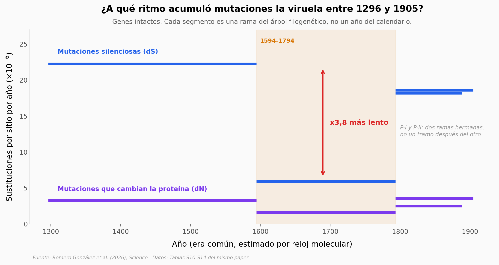

# El genoma de la viruela que llegó a América

Dos personas enterradas en Camarones 9, en el norte de Chile, murieron entre 1492 y 1631 con viruela. De sus restos se recuperaron los primeros genomas antiguos del virus en América: un linaje que hoy está extinto, que se separó del tronco europeo alrededor de 1296 y que ya venía con casi una cuarta parte de sus genes rotos. Este notebook reconstruye, desde las tablas suplementarias del paper, a qué ritmo mutó el virus en cada tramo de su árbol y cuándo se rompió cada gen.

**El hallazgo:** **entre 1594 y 1794 el reloj molecular del virus corre entre 3,1 y 3,8 veces más lento**, y después vuelve a acelerarse.

## Gráfica clave



## Reproducir

[](https://colab.research.google.com/github/Ciencia-a-Mordiscos/lab/blob/main/papers/2026-07-31-viruela-antigua-sudamerica/notebook.ipynb)

O localmente:
```bash
pip install pandas matplotlib numpy scipy
jupyter execute notebook.ipynb
```

## Datos

- `datos/substitution_rates.csv` — tabla S14: tasas sinónimas y no sinónimas con su ventana temporal, 4 ramas × 4 clases de gen (16 filas)
- `datos/gene_status_by_group.csv` — tabla S10: inventario de los 214 genes por grupo funcional (8 filas)
- `datos/gene_status_per_genome.csv` — tabla S11: estado gen a gen en CAM9_208 y en 4 genomas medievales (214 filas)
- `datos/inactivation_by_lineage.csv` — derivado de S11: genes por categoría de linaje (7 filas)
- `datos/inactivating_mutations.csv` — tabla S12: las 20 mutaciones inactivantes, con rama y gen (20 filas)
- `datos/genome_coverage.csv` — tabla 1: cobertura y daño terminal de los dos genomas antiguos (2 filas)

## Links

- **Video:** [Pendiente]
- **Paper:** [Science — DOI: 10.1126/science.aee6957](https://doi.org/10.1126/science.aee6957)
- **Datos originales:** [Supplementary Tables S9–S14](https://www.science.org/doi/suppl/10.1126/science.aee6957/suppl_file/science.aee6957_tables_s9_to_s14.zip)
- **Lecturas crudas:** [European Nucleotide Archive PRJEB104199](https://www.ebi.ac.uk/ena/browser/view/PRJEB104199)
