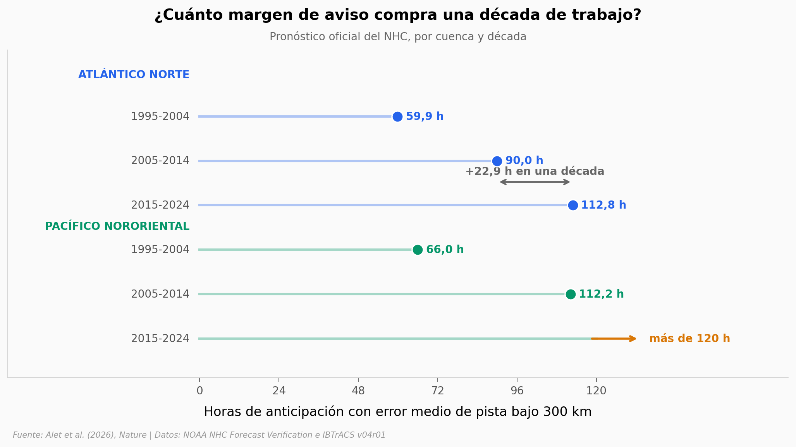

# El pronóstico de huracanes ganó 23 horas en una década. Google dice que gana un día de golpe

Google DeepMind publicó en *Nature* WeatherNext Cyclones, un modelo de IA que genera hasta 1.000 escenarios posibles de un ciclón con 15 días de anticipación, y reporta una ventaja media de un día o más frente a los modelos operativos líderes. El paper no publica sus tablas de resultados como datos, así que aquí no auditamos el modelo: reconstruimos la **vara con la que se mide esa ventaja**, usando las dos fuentes públicas sobre las que el paper se apoya.

**El hallazgo:** con el archivo de verificación del NHC, una década entera de progreso operativo compró **22,9 horas** de anticipación en el Atlántico — a menos del 5 % de las ~22 h que el paper atribuye a ese mismo salto por un camino independiente. Y en el Pacífico Nororiental el pronóstico de la última década ya no cruza el umbral de 300 km dentro de los 5 días verificados: se salió de la escala.

## Gráfica clave



## Reproducir

[](https://colab.research.google.com/github/Ciencia-a-Mordiscos/lab/blob/main/papers/2026-08-06-ciclones-tropicales-ia/notebook.ipynb)

O localmente:
```bash
pip install pandas matplotlib numpy scipy
jupyter execute notebook.ipynb
```

## Datos

- `datos/ibtracs_tormentas_2023_2025.csv` — 256 tormentas tropicales/subtropicales de 2023 a 2025 con viento máximo ≥ 34 kt, en seis cuencas (IBTrACS v04r01, la misma verdad-terreno del paper)
- `datos/nhc_error_anual.csv` — error medio anual del pronóstico oficial del NHC por cuenca, año y horizonte (1970-2025), 536 filas
- `datos/nhc_decadas.csv` — la misma verificación agregada por décadas (1995-2004, 2005-2014, 2015-2024), 42 filas

## Links

- **Video:** [Pendiente]
- **Paper:** [Nature — DOI: 10.1038/s41586-026-10953-2](https://doi.org/10.1038/s41586-026-10953-2)
- **Datos originales:** [IBTrACS (NOAA NCEI)](https://www.ncei.noaa.gov/products/international-best-track-archive) · [NHC Forecast Verification](https://www.nhc.noaa.gov/verification/verify7.shtml)
