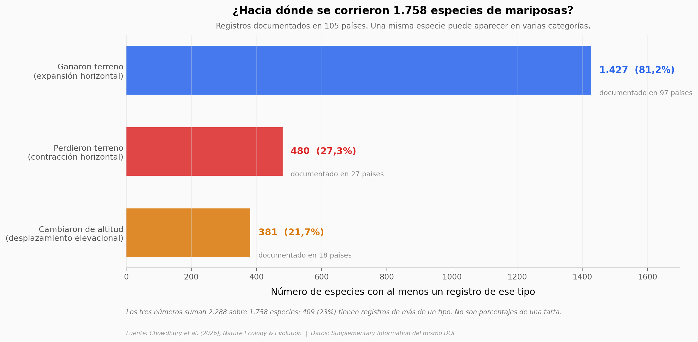

# 1.758 mariposas cambiaron de sitio. El 65% tiene un solo registro detrás

Un equipo compiló 6.182 registros de desplazamiento sacados de 567 estudios en quince idiomas y 68 evaluaciones de expertos: 1.758 especies de mariposas en 105 países, el 9,1% de la diversidad conocida. El 81,2% ganó terreno, el 27,3% lo perdió y el 21,7% cambió de altitud — números que no suman 100 porque 409 especies aparecen en más de una categoría. Este notebook reconstruye el inventario y, sobre todo, mide la fuerza de la evidencia que lo sostiene.

**El hallazgo:** **el 65% de las especies del inventario entró con un solo registro, de un solo estudio, en un solo país. Solo 94 (5%) tienen más de diez registros independientes.** El mapa no dice dónde se mueven las mariposas: dice dónde hay gente contándolas.

## Gráfica clave



## Reproducir

[](https://colab.research.google.com/github/Ciencia-a-Mordiscos/lab/blob/main/papers/2026-08-06-mariposas-desplazamientos-clima/notebook.ipynb)

O localmente:
```bash
pip install pandas matplotlib numpy
jupyter execute notebook.ipynb
```

## Datos

- `datos/especies_familia.csv` — las 1.758 especies con su familia, parseadas del Supplementary Information (1.758 filas, 1.758 especies únicas, 6 familias, 0 duplicados)
- `datos/familias_resumen.csv` — conteo y % por familia (6 filas)
- `datos/tipos_desplazamiento.csv` — especies y países por tipo de desplazamiento (3 filas). **No aditivo**
- `datos/composicion_regional.csv` — composición por región (3 filas). Solo Europa tiene el desglose completo
- `datos/amenaza_clima_por_tipo.csv` — especies con clima atribuido por tipo (3 filas). **No aditivo**
- `datos/paises_destacados.csv` — porcentajes por país en **dos bases distintas** (6 filas); la columna `base` es obligatoria al leerlos
- `datos/concentracion_evidencia.csv` — cuántos registros sostienen a cada especie (4 filas)
- `datos/estudios_por_anio.csv` — año de publicación de 461 de los 567 estudios (81,3%), 1948–2024

## Links

- **Video:** [Ver en YouTube](https://youtube.com/shorts/I1Gz748RZZI)
- **Paper:** [Nature Ecology & Evolution — DOI: 10.1038/s41559-026-03117-y](https://doi.org/10.1038/s41559-026-03117-y)
- **Datos originales:** [Supplementary Information del mismo DOI](https://media.springernature.com/original/springer-static/esm/art%3A10.1038%2Fs41559-026-03117-y/MediaObjects/41559_2026_3117_MOESM1_ESM.pdf)
