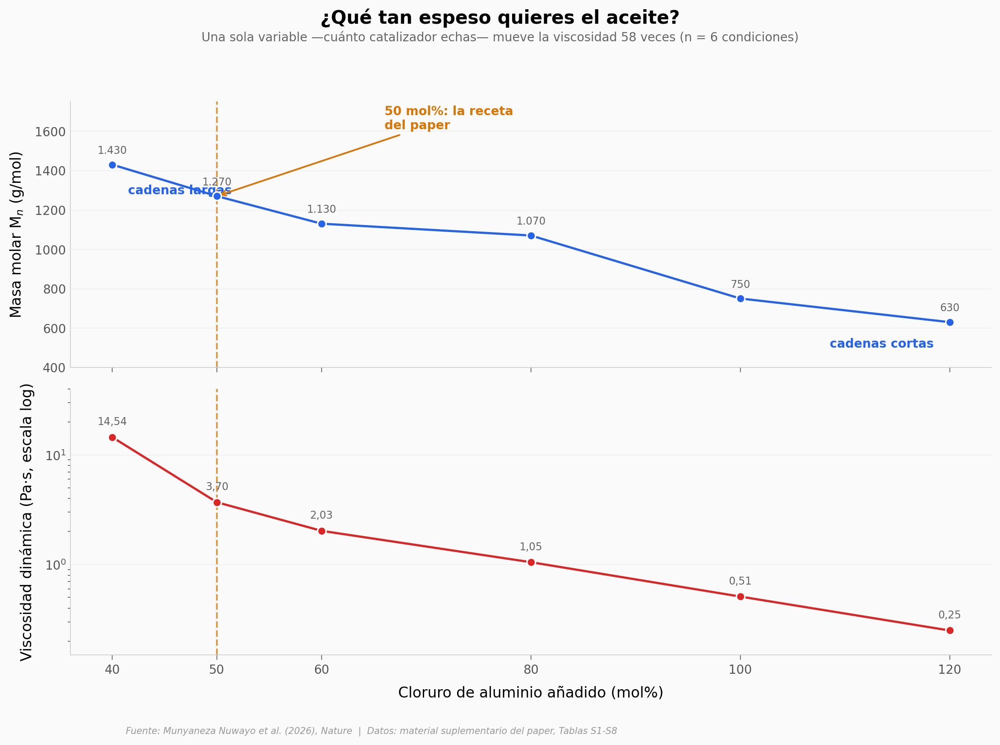

# Convirtieron tuberías de PVC en aceite de motor

El PVC es el plástico más difícil de reciclar: el 56,7% de su peso es cloro, y ese cloro se escapa al suelo y al agua junto con los aditivos. Un equipo publicó en *Nature* una ruta distinta — en vez de intentar volver a hacer PVC, lo desarman. Mezclado con una alfa-olefina y cloruro de aluminio a 70 °C, el plástico pierde el cloro, se parte y sus pedazos se pegan a las olefinas hasta formar una polialfaolefina: el aceite base sintético de los lubricantes de motor modernos.

Este notebook abre las tablas del Supplementary y verifica cuatro cosas: cuánto controla la dosis de catalizador la viscosidad del aceite, cuántos metales del plástico de desecho llegan al producto, si usar basura real en vez de plástico de laboratorio empeora el resultado, y cuánto del frasco final es realmente residuo.

**El hallazgo:** una sola variable —la carga de AlCl₃, entre 40 y 120 mol%— mueve la viscosidad **58,2 veces** (14,54 → 0,25 Pa·s), con ρ = −1,00 en las seis condiciones medidas. Y el dato incómodo: el PVC aporta el **30% de la masa reactiva y el 3,8% del costo** de los tres insumos del acoplamiento. El 1-deceno, petroquímico virgen, pone el 83%.

## Gráfica clave



## Reproducir

[](https://colab.research.google.com/github/Ciencia-a-Mordiscos/lab/blob/main/papers/2026-08-06-pvc-lubricantes-vpao/notebook.ipynb)

O localmente:

```bash
pip install pandas matplotlib numpy scipy
jupyter execute notebook.ipynb
```

## Datos

Los siete CSV se transcribieron de las Tablas S1–S9 del Supplementary Information del paper (PDF de 74 páginas, acceso libre en `media.springernature.com`). El repositorio Dryad citado en el *Data availability* todavía no era público al momento de generar este notebook.

- `datos/alcl3_dosis.csv` — dosis-respuesta de la carga de AlCl₃ (40–120 mol%) sobre CH₂/CH₃, masa molar y viscosidad dinámica. 6 condiciones (Tabla S2)
- `datos/olefina_solvente.csv` — efecto de la longitud de la alfa-olefina y del solvente sobre ramificación y viscosidad; incluye el control sin PVC. 6 aceites (Tabla S1)
- `datos/solventes.csv` — relación CH₂/CH₃ en 6 solventes a 50 mol% de AlCl₃ (Tabla S4)
- `datos/metales_icpms.csv` — ICP-MS de 8 metales en 5 muestras, formato largo. 40 filas (Tabla S5)
- `datos/propiedades_termicas.csv` — Td5%, Td50% y Tg de 17 lubricantes por materia prima y solvente (Tabla S6)
- `datos/precios_usd_ton.csv` — precios de mercado de insumos y producto, USD/tonelada. 8 filas (Tabla S8)
- `datos/balance_masa_costo.csv` — balance de masa por 100 kg de lubricante cruzado con precios. 6 insumos (Tabla S8 + SI §12.2.4)

## Links

- **Video:** [Ver en YouTube](https://youtube.com/shorts/_SOIcBVm8dk)
- **Paper:** [Nature — DOI: 10.1038/s41586-026-10867-z](https://doi.org/10.1038/s41586-026-10867-z)
- **Datos originales:** [Supplementary Information (PDF)](https://media.springernature.com/original/springer-static/esm/art%3A10.1038%2Fs41586-026-10867-z/MediaObjects/41586_2026_10867_MOESM1_ESM.pdf)
