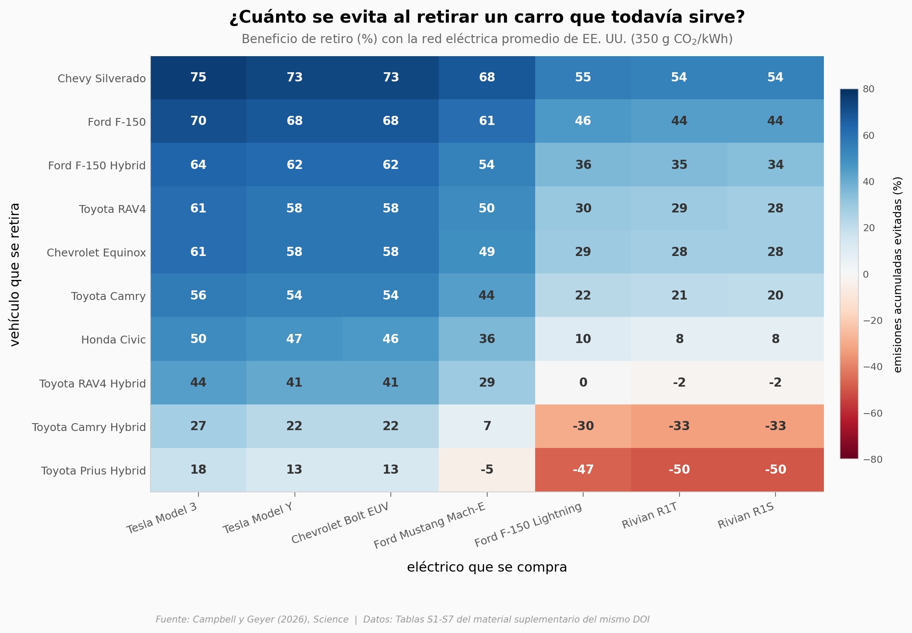

# El carro que todavía sirve

Tu carro prende, gasta lo de siempre y le quedan años. Cambiarlo por uno eléctrico suena a desperdicio: la batería nueva llega con emisiones de fábrica que el carro que ya tienes dejó pagadas hace rato. Un equipo hizo la cuenta de ciclo de vida para 210 combinaciones de vehículo retirado, eléctrico de reemplazo y red eléctrica, y publicó la matriz completa en el material suplementario. Aquí la reconstruimos.

**El hallazgo:** en **160 de las 210 combinaciones (76,2%)** chatarrizar el carro que todavía funciona emite menos. Pero el resultado no vive en el carro: vive en el enchufe. La mediana pasa de **54,5%** con la red de California a **41%** con el promedio de EE. UU. y a **3,5%** con la de Puerto Rico. ⚠️ El bloque rojo tiene nombre: retirar un **híbrido** deja mediana 20% frente al 50% de los que no lo son, y con red sucia baja a **−29,5%**. ⚠️ El 92% que cita el paper viene de su análisis continuo, no de estas tablas — no son la misma métrica. ⚠️ Es un **modelo**, no una medición, todo referido a Estados Unidos, y su propuesta es de **política pública**: el propio resumen dice que hoy chatarrizar es económicamente prohibitivo para el dueño.

## Gráfica clave



## Reproducir

[](https://colab.research.google.com/github/Ciencia-a-Mordiscos/lab/blob/main/papers/2026-08-06-retirar-carro-gasolina/notebook.ipynb)

O localmente:
```bash
pip install pandas matplotlib numpy scipy
jupyter execute notebook.ipynb
```

## Datos

- `datos/beneficio_retiro_matriz.csv` — beneficio de retiro (%) para 10 vehículos de gasolina/híbridos × 7 eléctricos × 3 intensidades de red. 210 filas, de las Tablas S5–S7
- `datos/subredes_electricas_eeuu.csv` — 27 subredes eGRID 2023: intensidad de carbono (kg CO₂/MWh) y generación neta. De la Tabla S3
- `datos/eficiencias_referencia.csv` — emisiones de uso (g CO₂/km) y consumo eléctrico (kWh/100 km) por clase y categoría. 24 filas, de las Tablas S1 y S2
- `datos/umbral_kilometraje_anual.csv` — kilometraje anual de equilibrio por clase, extraído del texto del paper

Las Tablas S3 y S5–S7 son imágenes dentro del PDF suplementario: la transcripción a CSV es nuestra.

## Links

- **Video:** [Ver en YouTube](https://youtube.com/shorts/S3CjLYbIRwo)
- **Paper:** [Science — DOI: 10.1126/science.adv5441](https://doi.org/10.1126/science.adv5441)
- **Datos originales:** [Supplementary Materials, mismo DOI](https://www.science.org/doi/suppl/10.1126/science.adv5441/suppl_file/science.adv5441_sm.pdf)
