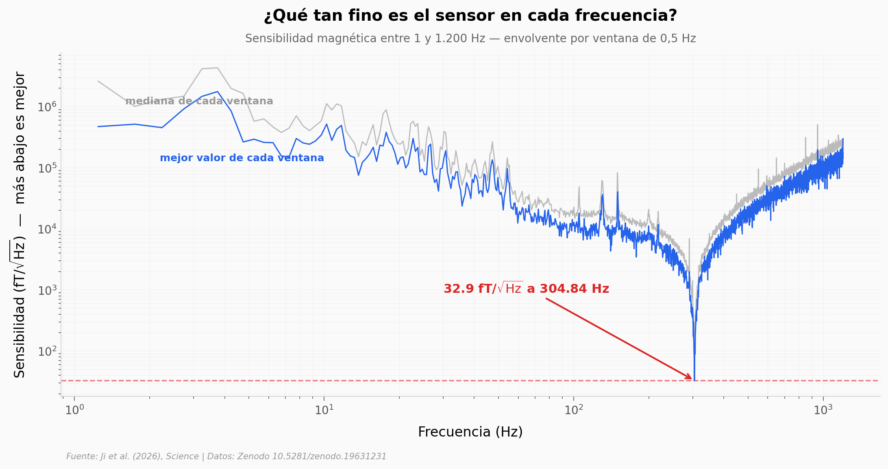

# Un imán flotando midió 32 femtoteslas — pero solo en una nota

Un imán diminuto que levita sin tocar nada, leído por un láser, alcanzó una sensibilidad magnética de 32 femtoteslas por raíz de hercio: mil millones de veces por debajo del campo magnético de la Tierra, a temperatura ambiente y sin blindaje. Abrimos los datos que los autores depositaron en Zenodo y encontramos el récord — y también dónde vive: en un pico de 0,04 Hz de ancho. A 1,25 Hz el mismo sensor mide 14.317 veces peor.

**El hallazgo:** **32,94 fT/√Hz a 304,84 Hz**, con la media de cinco repeticiones en **30,3 ± 2,4** — pero el pico contiguo por debajo de 100 fT/√Hz mide **0,04 Hz**, mientras que los SQUID y los magnetómetros atómicos con los que se compara operan en banda ancha.

## Gráfica clave



## Reproducir

[](https://colab.research.google.com/github/Ciencia-a-Mordiscos/lab/blob/main/papers/2026-08-07-magnetometro-levitado/notebook.ipynb)

O localmente:
```bash
pip install pandas matplotlib numpy
jupyter execute notebook.ipynb
```

## Datos

- `datos/sensibilidad_banda_completa.csv` — sensibilidad de 1 a 1.200 Hz, envolvente mínima y mediana por ventana de 0,5 Hz (2.399 filas)
- `datos/presupuesto_ruido_zoom.csv` — presupuesto de ruido de 303,5 a 306,0 Hz a resolución de 0,01 Hz, con los cinco componentes estimados (251 filas)
- `datos/espectros_repeticiones.csv` — cinco espectros repetidos, media y banda de incertidumbre (249 filas)
- `datos/curva_respuesta_medida.csv` — 13 puntos de respuesta con barra de error
- `datos/respuesta_campo_guia.csv` — 6 puntos de respuesta para dos campos guía

Todos derivan de `MatlabCodeData.zip` depositado por los autores en Zenodo (CC-BY-4.0).

## Links

- **Video:** [Ver en YouTube](https://youtube.com/shorts/IT2pe2D4Edc)
- **Paper:** [Science — DOI: 10.1126/science.adx1707](https://doi.org/10.1126/science.adx1707)
- **Datos originales:** [Zenodo 10.5281/zenodo.19631231](https://doi.org/10.5281/zenodo.19631231)
