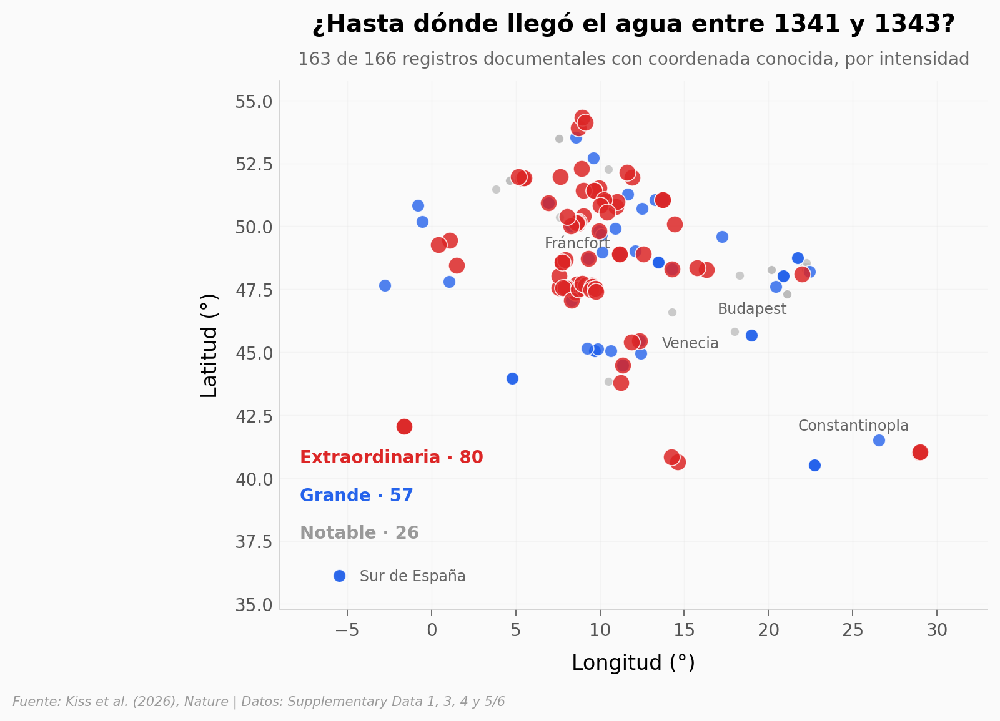

# Las megacrecidas que dejaron a Europa bajo el agua en 1342

Entre finales de 1341 y 1343, las crónicas europeas registran crecidas desde Andalucía hasta la costa del mar del Norte y hasta Constantinopla. Kiss et al. reunieron 166 registros documentales —crónicas de monasterios, actas municipales, cuentas de reparación de puentes— y los cruzaron con una serie de 715 años de frecuencia de crecidas. Este notebook rehace esas cuentas sobre los datos publicados y también marca dónde nuestro conteo crudo no coincide con el del paper, y por qué.

**El hallazgo:** **1342 es el año con más crecidas grandes o extraordinarias de los últimos 700 años** — 62 series fluviales afectadas, frente a una mediana anual de 5 y a las 47 del segundo año del registro (1845).

## Gráfica clave



## Reproducir

[](https://colab.research.google.com/github/Ciencia-a-Mordiscos/lab/blob/main/papers/2026-08-12-megainundaciones-europa-1342/notebook.ipynb)

O localmente:
```bash
pip install pandas matplotlib numpy
jupyter execute notebook.ipynb
```

## Datos

- `datos/inundaciones_documentadas.csv` — 166 registros documentales de crecidas 1341-1343: fecha, estación, localidad, país actual, coordenadas, cuerpo de agua, intensidad (escalas 1-3 y 1-6), duración e índices de incertidumbre.
- `datos/frecuencia_700_anios.csv` — serie 1300-2014 (715 años) con el conteo anual de crecidas por clase sobre 402 series fluviales europeas. **Conteo crudo**, sin la corrección de sesgo que usa el paper.
- `datos/impactos_socioeconomicos.csv` — 29 categorías de impacto (puentes, cosechas, hambruna, víctimas) con número de registros y severidad media y máxima en escala 1-5.
- `datos/causas_climaticas.csv` — forzantes climáticos anuales 1200-1500 compilados por los autores desde reconstrucciones de terceros: irradiancia solar, NAO, sulfato volcánico, hielo ártico, posición del jet y conteo de erupciones.

Todos derivan del Supplementary Material del paper. Los scripts de extracción están en el repositorio del servidor.

## Links

- **Video:** [Ver en YouTube](https://youtube.com/shorts/_ZEPDWzkkh0)
- **Paper:** [Nature — DOI: 10.1038/s41586-026-10888-8](https://doi.org/10.1038/s41586-026-10888-8)
- **Datos originales:** [Supplementary Material del paper](https://doi.org/10.1038/s41586-026-10888-8)
