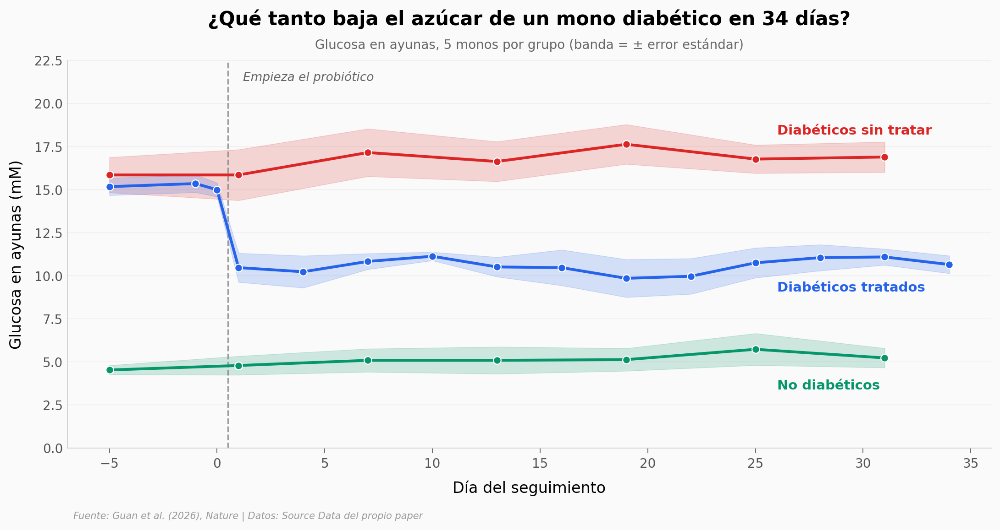

# Un probiótico que solo trabaja cuando el azúcar sube

Un equipo tomó *Escherichia coli* Nissle — la bacteria que ya se vende como probiótico — y le instaló un circuito genético que lee la glucosa del entorno: cuando el azúcar pasa cierto nivel, la bacteria fabrica GLP-1, la hormona que le dice al páncreas que suelte insulina. Se toma por la boca, pasa un rato por el intestino y sale. Cinco monos diabéticos la tomaron durante 34 días.

**El hallazgo:** la glucosa en ayunas de los monos bajó de **15,16 a 10,57 mM (−30,3%)**, y los 5 de 5 bajaron. Pero los monos sanos de ese mismo experimento están en **5,07 mM**: los tratados quedan **5,50 mM por encima**. Cierran, en promedio, el **44,5%** de su distancia a un mono sano. Bajan mucho; no se curan.

El sensor no es un dial, es un interruptor: está casi mudo hasta 5 mM y salta **9,9 veces** al llegar a 10 (d = 6,33). ⚠️ El p = 0,0045 de la glucosa en ayunas es cálculo nuestro — la tabla estadística del paper no lista test para ese panel; el del área bajo la curva (p = 0,0123) sí reproduce exactamente el suyo. ⚠️ Uno de los cinco monos apenas se movió (−4% frente a −29% a −37% de los otros). ⚠️ n = 5 monos: con esa muestra el Wilcoxon no puede bajar de p = 0,0625. ⚠️ Nada de esto se ha probado en personas — está en el título del paper.

## Gráfica clave



## Reproducir

[](https://colab.research.google.com/github/Ciencia-a-Mordiscos/lab/blob/main/papers/2026-08-12-probioticos-glucosa-diabetes/notebook.ipynb)

O localmente:
```bash
pip install pandas matplotlib numpy scipy
jupyter execute notebook.ipynb
```

## Datos

- `datos/sensor_dosis_respuesta.csv` — señal del sensor frente a glucosa 0-25 mM, 3 réplicas (21 filas)
- `datos/sensor_reversibilidad.csv` — encendido/apagado con glucosa alternada, 12 h (72 filas)
- `datos/comida_real_glucemia.csv` — glucemia de ratones tras cola, cola dietética, chocolate, pienso o control (150 filas)
- `datos/dosis_glucosa_glucemia.csv` · `datos/dosis_glucosa_senal.csv` — dosis-respuesta in vivo (120 filas c/u)
- `datos/sensor_invivo_raton.csv` — señal en ratones sanos frente a db/db (20 filas)
- `datos/postprandial_raton.csv` — glucemia postprandial en ratón (60 filas)
- `datos/monos_glucemia_ayunas.csv` — 34 días, 3 grupos de 5 monos (145 filas)
- `datos/monos_ogtt.csv` · `datos/monos_auc.csv` — prueba de tolerancia a la glucosa, pareada (50 y 10 filas)
- `datos/monos_peso.csv` — peso de los monos (65 filas)

## Links

- **Video:** [Ver en YouTube](https://youtube.com/shorts/AkbPcNil1lM)
- **Paper:** [Nature — DOI: 10.1038/s41586-026-10909-6](https://doi.org/10.1038/s41586-026-10909-6)
- **Datos originales:** Source Data del propio paper (Figs. 1, 3 y 5 + Extended Data Fig. 8 + Supplementary Table 16)
