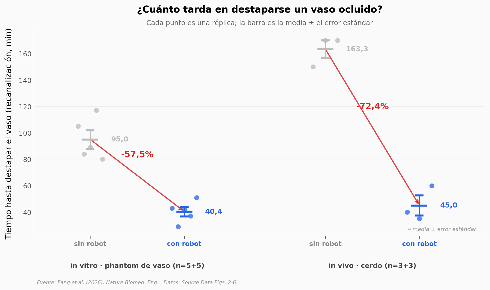

# Un robot con cilios que destapa arterias

Cuando una arteria se tapa, el problema no termina en el tapón: detrás de él la sangre casi deja de moverse, y el fármaco que disuelve coágulos llega solo por difusión. Fang y su equipo construyeron un robot blando de silicona con partículas magnéticas y un tapete de cilios que baten en onda coordinada — se navega con un imán desde fuera, se para junto al coágulo y empieza a empujar sangre. En cerdos vivos, el vaso ocluido se destapó en 45 minutos en lugar de 163.

**El hallazgo:** **el tiempo de recanalización cayó un 72,4% in vivo (163,3 → 45,0 min) y un 57,5% in vitro (95,0 → 40,4 min)**, con separación total entre grupos — aunque con 3 animales por grupo ningún test puede bajar de p = 0,10.

## Gráfica clave



## Reproducir

[](https://colab.research.google.com/github/Ciencia-a-Mordiscos/lab/blob/main/papers/2026-08-17-robot-endovascular-cilios-flujo/notebook.ipynb)

O localmente:
```bash
pip install pandas matplotlib numpy scipy
jupyter execute notebook.ipynb
```

## Datos

- `datos/recanalizacion_invivo.csv` — tiempo de recanalización en cerdo, valores crudos por réplica (n=3+3)
- `datos/recanalizacion_invitro.csv` — tiempo de recanalización en phantom, valores crudos por réplica (n=5+5)
- `datos/tpa_concentracion.csv` — tPA dentro del coágulo, 11 tiempos de 0 a 50 min, con y sin robot
- `datos/flujo_vs_frecuencia_onda.csv` — flujo vs frecuencia, onda simpléctica vs antipléctica (11 puntos)
- `datos/flujo_vs_cobertura.csv` — flujo vs ángulo de cobertura del tapete, 45° a 360° (8 puntos)
- `datos/flujo_vs_frecuencia_fondo.csv` — flujo en la rama por velocidad del vaso principal (44 combinaciones)
- `datos/flujo_espaciado_cilios.csv` — grid 4×4 de espaciado entre cilios
- `datos/flujo_vs_angulo_rama.csv`, `datos/flujo_vs_inclinacion.csv` — flujo vs frecuencia por geometría de la rama
- `datos/robot_velocidad_iman.csv`, `datos/robot_velocidad_contraflujo.csv`, `datos/robot_velocidad_distancia.csv` — control del robot
- `datos/cilio_asimetria.csv` — asimetría temporal y espacial del batido vs ángulo campo-cilio

Todos derivados del Source Data (Figs. 2–6) que Nature publica junto al paper.

## Links

- **Video:** [Pendiente]
- **Paper:** [Nature Biomedical Engineering — DOI: 10.1038/s41551-026-01771-y](https://doi.org/10.1038/s41551-026-01771-y)
- **Datos originales:** [Source Data Figs. 2–6](https://media.springernature.com/original/springer-static/esm/art%3A10.1038%2Fs41551-026-01771-y/MediaObjects/41551_2026_1771_MOESM11_ESM.xlsx)
