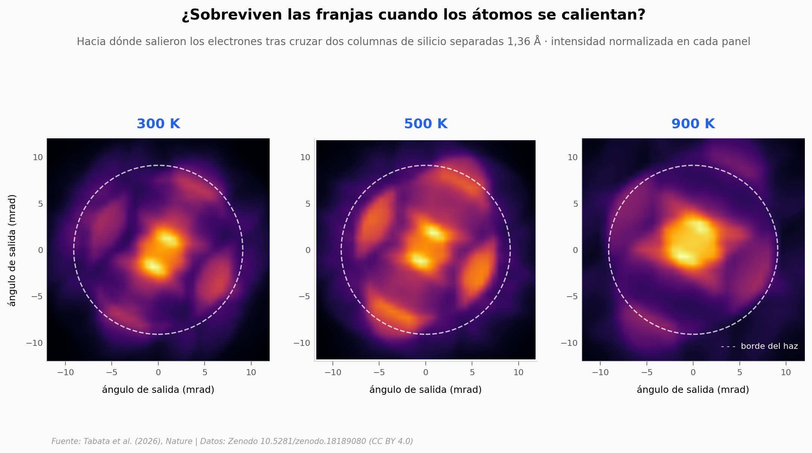

# La rendija de Young, encogida siete órdenes de magnitud

Un haz de electrones enfocado en un microscopio STEM cubre a la vez dos columnas vecinas de átomos de silicio, separadas 1,36 Å, y sale con franjas de interferencia. Es el experimento de Young de 1801 con rendijas de tamaño atómico — y con la complicación de que esas rendijas vibran. Este notebook explora las salidas de figura publicadas: los patrones medidos a 300, 500 y 900 K, el paisaje de error del que sale el ajuste de correlación, y el cálculo de vibraciones de la red.

**El hallazgo:** a 900 K cada átomo se mueve un **62,5% más** que a 300 K (0,08 → 0,13 Å, sobre un hueco de 1,36 Å) y las franjas siguen ahí. La razón es que las dos columnas no tiemblan por separado: el enlace Si–Si las obliga a acompañarse, y resiste el estiramiento **3,2 veces más** que el corte lateral.

## Gráfica clave



## Reproducir

[](https://colab.research.google.com/github/Ciencia-a-Mordiscos/lab/blob/main/papers/2026-08-19-doble-rendija-atomica-silicio/notebook.ipynb)

O localmente:
```bash
pip install pandas matplotlib numpy
jupyter execute notebook.ipynb
```

## Datos

- `datos/cbed_exp_300k.npy`, `_500k`, `_900k` — patrones de dispersión medidos, 182×182 cuentas de electrones enteras (convertidos desde los TIFF de 64 bits del repositorio, que PIL no sabe leer)
- `datos/cbed_experimental.csv` — metadatos de cada patrón: dosis total, radio del haz, escala angular
- `datos/correlaciones_temperatura.csv` — coeficientes de correlación publicados con su intervalo del 95%, rigideces, desplazamiento por átomo y espesor, para las 3 temperaturas
- `datos/mse_landscape_300k.csv`, `_500k`, `_900k` — paisaje de error del ajuste, rejilla 41×41 en (ρx, ρy), 1.681 celdas cada uno
- `datos/dispersion_fonones.csv` — 9.696 modos de vibración del silicio (808 puntos × 12 ramas) con el peso proxy por componente
- `datos/gamma_desplazamiento_relativo.csv` — desplazamiento relativo entre columnas de las 12 ramas en el punto Γ
- `datos/perfil_radial_cbed.csv` — perfil radial normalizado de los tres patrones

## Links

- **Video:** [Ver en YouTube](https://youtube.com/shorts/TRGSfrMh43A)
- **Paper:** [Nature — DOI: 10.1038/s41586-026-10914-9](https://doi.org/10.1038/s41586-026-10914-9)
- **Datos originales:** [Zenodo 10.5281/zenodo.18189080](https://doi.org/10.5281/zenodo.18189080) (CC BY 4.0)
