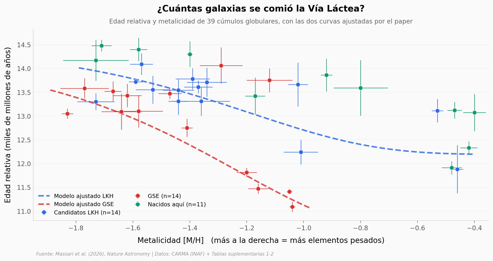

# La fusión que se nos había escondido

La Vía Láctea se tragó al menos una galaxia entera unos 1.800 millones de años antes de la fusión más antigua que teníamos confirmada. No quedó ni una foto del evento: la pista está en 39 cúmulos globulares que todavía orbitan el interior de nuestra galaxia. Con edades relativas del Hubble mucho más precisas que las anteriores (0,26 contra 0,91 de un catálogo previo y 0,43 de otro), esos cúmulos se ordenan en tres secuencias distintas dentro del plano edad–metalicidad — y una de ellas no correspondía a ningún progenitor conocido. El equipo la bautizó Low-energy-Kraken-Heracles (LKH).

**El hallazgo:** los dos progenitores dejaron de formar cúmulos con **1,76 mil millones de años de diferencia** (12,19 contra 10,43 en la escala de edad relativa), y **13 de los 14 candidatos a LKH quedaron dentro de los 6 kiloparsecs interiores**, frente a 0 de 14 en Gaia-Sausage-Enceladus.

## Gráfica clave



## Reproducir

[](https://colab.research.google.com/github/Ciencia-a-Mordiscos/lab/blob/main/papers/2026-08-19-fusion-lkh-cumulos-globulares/notebook.ipynb)

O localmente:

```bash
pip install pandas matplotlib numpy scipy
jupyter execute notebook.ipynb
```

## Datos

- `datos/cumulos_39.csv` — los 39 cúmulos globulares con edad homogénea: 17 filas nuevas de la Suppl. Tabla 1 del paper y 22 de la tabla pública CARMA-IV. Columnas de edad, metalicidad, módulo de distancia, asociación dinámica y distancia galactocéntrica calculada.
- `datos/modelos_amr.csv` — parámetros ajustados de la relación edad–metalicidad para LKH y GSE (`p`, `t_i`, `t_f`, masa) con sus errores asimétricos. Alimentan la ecuación (1) de Methods.
- `datos/precision_edades.csv` — error medio de edad de tres catálogos: CARMA (0,26 Gyr), VandenBerg (0,43) y Dotter (0,91).

> **Nota de honestidad.** La lista de los 39 es una reconstrucción nuestra: el paper no la publica explícita. Y los grupos que usamos vienen de la asociación dinámica pública de CARMA (30/10/2025), anterior al paper y sin la etiqueta LKH — son un sustituto de la clasificación bayesiana del paper, no la clasificación del paper. El notebook lo declara en cada sección donde importa.

## Links

- **Video:** [Ver en YouTube](https://youtube.com/shorts/YB8he8DhwjU)
- **Paper:** [Nature Astronomy — DOI: 10.1038/s41550-026-02931-5](https://doi.org/10.1038/s41550-026-02931-5)
- **Datos originales:** [CARMA (INAF OAS Bologna)](https://www.oas.inaf.it/en/research/m2-en/carma-en) · [HUGS / HST (STScI)](https://archive.stsci.edu/prepds/hugs)
