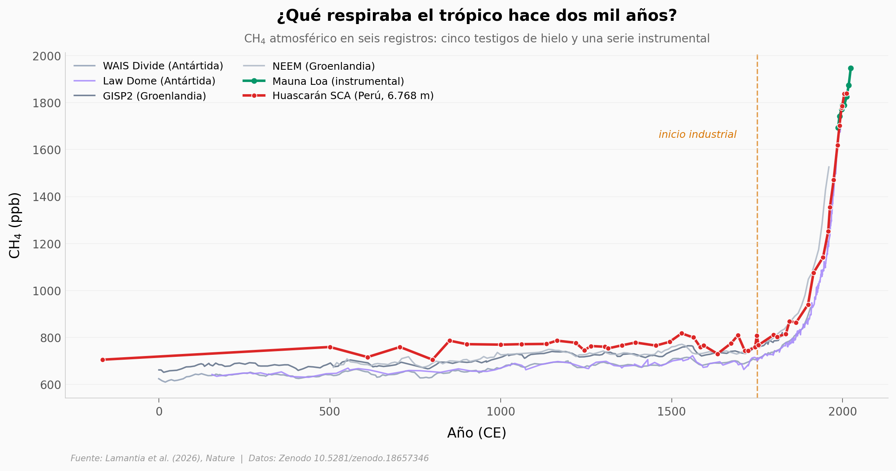

# El metano que los polos no supieron contar

Durante décadas la historia del metano atmosférico se leyó en Groenlandia y la Antártida, aunque el metano natural se fabrica sobre todo en humedales tropicales. Un equipo perforó hielo a 6.768 metros en el Nevado Huascarán (Perú) y sacó unos 2.000 años de aire tropical: el primer registro histórico global de CH₄ tomado en latitudes bajas. Ese testigo corre por encima de los cuatro registros polares en el preindustrial, y ese desnivel es todo el resultado.

**El hallazgo:** **+62,3 ppb de media sobre los testigos polares** en el preindustrial (119 de 123 comparaciones positivas, a partir de 31 muestras tropicales × 4 testigos). Al meter ese registro en el modelo atmosférico de 4 cajas de los autores, la emisión tropical preindustrial estimada pasa de **161,4 a 212,5 Tg CH₄/año (+31,6%)**.

## Gráfica clave



## Reproducir

[](https://colab.research.google.com/github/Ciencia-a-Mordiscos/lab/blob/main/papers/2026-08-19-metano-tropical-huascaran/notebook.ipynb)

O localmente:
```bash
pip install pandas matplotlib numpy scipy
jupyter execute notebook.ipynb
```

El notebook **re-ejecuta el modelo de 4 cajas** de los autores con su semilla original (42, 1.000 iteraciones Monte Carlo) en unos 7 segundos: no carga un resultado precocinado.

## Datos

- `datos/ch4_registros.csv` — CH₄ (ppb) por registro y año CE. 916 filas, 6 registros: Huascarán SCA (50), WAIS (228), GISP2 (172), Law Dome (329), NEEM (129), Mauna Loa (8)
- `datos/d13c_registros.csv` — δ¹³C-CH₄ (‰ VPDB). 171 filas; Huascarán n=5
- `datos/huascaran_20yr_avgs.csv` — promedios de 20 años del Huascarán, entrada del modelo
- `datos/mitchell_gisp2.csv` · `datos/mitchell_wais.csv` · `datos/rhodes_neem.csv` — entradas polares del modelo

## Links

- **Video:** [Pendiente]
- **Paper:** [Nature — DOI: 10.1038/s41586-026-10938-1](https://doi.org/10.1038/s41586-026-10938-1)
- **Datos originales:** [Zenodo 10.5281/zenodo.18657346](https://doi.org/10.5281/zenodo.18657346)
